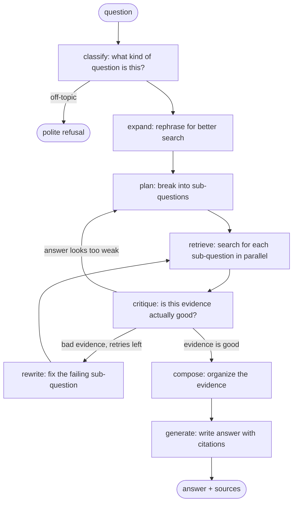
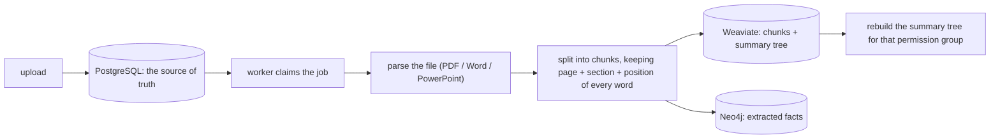

# Agentic RAG — a research agent for private company documents

**This system answers questions about a company's internal documents. It checks its own work, cites its sources, respects who is allowed to see what, and refuses to answer when it doesn't have the evidence.**

Built with: FastAPI · LangGraph · DeepSeek · Voyage AI · Weaviate Cloud · Neo4j Aura · PostgreSQL · Redis · MinIO · Docker

---

## 1. What problem this solves

Companies have huge piles of documents — filings, contracts, policies — and the only way to get answers from them is to have a person go read them. Chatbots that promise to do this usually fail in three ways:

- **They make things up.** That's a legal and compliance problem.
- **They show people documents they aren't allowed to see.** That's a security problem.
- **They quietly get worse over time.** Nobody notices until a customer does.

Here is how this system deals with each risk, and the test threshold that guards it. These thresholds live in [`evaluation/thresholds.json`](evaluation/thresholds.json), and the build fails if any of them slip:

| Risk | What the system does | Threshold |
| --- | --- | --- |
| Made-up answers | Every claim in an answer must point at a real piece of retrieved evidence. If it can't, the answer falls back to direct quotes. If there's no evidence at all, the system says so instead of guessing. | 95% of claims grounded, 99% of citations valid |
| Seeing the wrong documents | Every search is filtered by tenant and access group *before* any ranking happens — in the vector store, the graph, the cache, and the final database check. | Covered by dedicated security tests |
| Answering things it shouldn't | Off-topic or unanswerable questions get a refusal, not a guess. | 90% refusal accuracy |
| Quietly getting worse | Automatic evaluations run against known-good test sets, and speed is measured per query type. | 90% routing accuracy, 85% recall, speed limits per route |
| Runaway cost | Each request has hard limits: at most 30 model calls, 30 searches, 2 retries per sub-question. Cost per request is tracked in dollars. | Tracked on every run |

**Work doesn't get lost.** Every chat request is saved as a job in PostgreSQL. A worker takes a lease on the job, and progress is checkpointed step by step. If a worker crashes mid-answer, another worker picks the job up and continues from the last checkpoint. Redis is only used to make things faster — if it goes down, answers still complete correctly.

**An honest example of how this project measures itself.** The first version routed questions using keyword matching. Live testing showed it picked the right strategy only **16.7%** of the time on real-world phrasing. Adding an LLM double-check on every query raised that to **about 82%** — but made simple questions about 1.5 seconds slower. That trade was made deliberately, measured, and written down in the repo, including what to do if speed ever matters more.

---

## 2. How the agent works

The pipeline is a LangGraph state machine ([`backend/app/services/rag_pipeline.py`](backend/app/services/rag_pipeline.py)). The important part: it has **two loops**, so the agent can notice its own bad results and try again — it's not a straight line from question to answer.



- **Planning.** A comparison or multi-part question gets split into independent sub-questions, each searched at the same time.
- **Loop 1 — retry:** if the critic rejects a sub-question's evidence, that sub-question gets rewritten using the rejection reasons and searched again (up to 2 retries).
- **Loop 2 — escalate:** if a "simple" question comes back with weak evidence, the agent doesn't just answer badly — it goes back and re-plans it as a multi-step question.
- **Search is layered.** Each layer wraps the next ([`backend/app/components/hybrid_retriever.py`](backend/app/components/hybrid_retriever.py)):

```text
ActiveDocumentRetriever(            # last check: drop deleted or no-longer-permitted documents
  CachedRetriever(                  # cache of recent results, scoped by permissions
    RerankingRetriever(             # rerank the candidates with a dedicated model
      CompositeRetriever(
        WeaviateRetriever,          # keyword + vector search, plus a summary tree
        Neo4jRetriever))))          # knowledge graph for multi-step questions
```

- **Two extra retrieval tricks:** a RAPTOR summary tree (documents clustered and summarized layer by layer) for big-picture questions, and a knowledge graph in Neo4j (facts extracted from documents, connected by entities) for questions that need to hop between documents. Graph results are ranked with personalized PageRank.
- **Decision logic is kept separate** in [`backend/app/agents/`](backend/app/agents/) — the router, the question splitter, and the evidence grader are plain functions you can test without any database.

**How documents get in** (the worker, [`backend/app/worker.py`](backend/app/worker.py)):



PostgreSQL is the single source of truth. **Weaviate and Neo4j can always be rebuilt from it.** That means re-indexing with a new strategy is routine: build the new index version alongside the old one, evaluate it, then switch over — no downtime, no migration crisis ([`scripts/enqueue_shadow_reindex.py`](scripts/enqueue_shadow_reindex.py)).

---

## 3. Connecting it to company systems (and MCP)

**Being upfront: this repo does not include an MCP server yet.** What it has is the part that's actually hard to retrofit — a tool layer built so that adding MCP later is a small adapter, not a rewrite:

- Every retrieval tool ([`backend/app/tools/vector_search.py`](backend/app/tools/vector_search.py)) requires an explicit identity object — who is asking, which tenant, which groups. There is no code path that searches without one. So anything that wraps these tools, MCP included, gets the permission checks for free — they happen *below* the tool interface.
- The security model is the one an MCP deployment would need anyway: OIDC bearer tokens in production, resolved to tenant + groups ([`backend/app/security/auth.py`](backend/app/security/auth.py)); separate guards for input, evidence, and output ([`backend/app/security/`](backend/app/security/)).
- The migration path is: expose the tools as MCP tools, map MCP's login identity onto the existing identity object, done. Nothing about the search stack or its permission guarantees changes.

The difference matters: "MCP-compatible by design" is worth something. An MCP badge on a system that leaks documents between tenants is worse than nothing.

---

## 4. Knowing when it breaks (observability and evals)

**Tracing.** Every model call is traced to LangSmith with its index version, prompt version, and model name ([`backend/app/components/llm.py`](backend/app/components/llm.py)). By default the traces **hide the actual text** of inputs and outputs — you have to explicitly opt in to record content. That's the difference between tracing that passes a security review and tracing that only works in a demo.

**Logging.** Stage timings, per-tenant search-result counts (so you can spot one tenant's data crowding out another's on a shared index), and an explicit warning line every time a model call fails and a fallback kicks in — because a silent fallback is invisible any other way.

**Evaluations** ([`evaluation/`](evaluation/)):

- Known-good test sets for routing, retrieval, answer quality, refusals, and speed — including one built from the MultiHop-RAG research dataset, because small hand-made test sets give false confidence.
- Every generated claim is checked against the evidence it cites: grounded-claim rate, citation validity, refusal accuracy, recall.
- [`runtime_report.py`](evaluation/runtime_report.py) compares the scores against [`thresholds.json`](evaluation/thresholds.json) and **fails the build** if anything dropped. A quality regression blocks the merge instead of becoming a production incident.
- Per-request metrics (route taken, confidence, cost, claim counts) are saved to Postgres, and users can mark answers as grounded/useful — real feedback to test against later.
- A load test drives 100,000 requests through the real ingestion path (`evaluation/load_test.py`).

There's also a written retrospective ([`docs/eval-hardening-retrospective.md`](docs/eval-hardening-retrospective.md)) covering what was tried and **rejected**, and why — not just what shipped.

---

## 5. Things that went wrong, and what handles them now

All of these came up during development. All of them have code and tests behind them:

| What goes wrong | What happens now |
| --- | --- |
| The model returns broken JSON or an invalid response | The affected step falls back to a simpler method (keyword routing, no decomposition, heuristic grading) and logs a warning. The request is never restarted over one bad model call. |
| The agent could loop forever | Hard limits: 30 model calls and 30 searches per request, 2 retries per sub-question. A sub-question that runs out of budget is marked exhausted and never re-queued. |
| The model honestly says "I can't connect these facts" and returns zero claims | Subtle trap: a check like "all claims are cited" passes when there are no claims, so this would look like a perfect answer. There's an explicit branch that turns it into a refusal that lists what's missing. |
| The answer cites evidence that wasn't accepted | Verification fails, the answer falls back to numbered direct quotes, and the event is logged. Unverifiable prose is never kept. |
| A simple lookup finds only weak evidence | Instead of answering badly, the agent escalates and re-plans the question as multi-step. |
| A malicious document tries to inject fake facts | Extracted facts and summaries are checked against their own source text. If an extraction shares no vocabulary with the chunk it supposedly came from, it's rejected before it can permanently poison the graph. |
| Context windows fill up | Small chunks are searched, bigger parent chunks provide context; evidence is capped per sub-question; duplicate context is removed; summaries are capped at 4,000 characters so an overlong-but-valid one can't fail a rebuild. |
| A worker crashes mid-job | The job's lease expires, another worker claims it (up to 3 attempts), and it resumes from the last checkpoint. Permanent failures show the user an error — never a hang. |
| Redis goes down | Only live-progress streaming suffers. Workers fall back to polling and answers still complete, because the real queue is in Postgres. |
| The index has stale entries (deleted docs, revoked access) | A final check against the live database drops them — and re-searches wider so the filtering doesn't accidentally starve the query of evidence that still exists. |
| Someone uploads a scanned (image-only) PDF | It fails loudly with `OCR_REQUIRED` and the page numbers, instead of indexing nothing and pretending it succeeded. |
| Humans need to stay in control | The system refuses rather than guesses, collects per-answer feedback, rate-limits each tenant, and keeps every document version with its revision history. |

---

## 6. Cost and speed

**Use the cheap model almost everywhere.** DeepSeek Flash ($0.14 in / $0.28 out per million tokens) handles routing, expansion, critique, and normal answers. The Pro model (about 3× the price) is used for exactly two things where it's worth it: tricky routing decisions and final multi-step synthesis. Every run's token usage and dollar cost are recorded ([`observability/cost_tracker.py`](observability/cost_tracker.py)).

**Caching without leaks.** Search results are cached in Redis, but the cache key includes the tenant and the user's permission groups. A cache hit can never hand one user another user's results — which is the detail that makes caching safe to turn on in a multi-tenant system.

**Speed limits per question type, enforced by tests:** simple questions p95 ≤ 3.5s, summaries ≤ 10s, complex multi-step ≤ 30s ([`evaluation/query_latency.py`](evaluation/query_latency.py)).

**A documented trade-off:** the routing double-check that lifted accuracy from 16.7% to ~82% costs one extra model call on simple questions (p95 went from 2.0s to 3.5s). The rationale and the undo-path are written down: if sub-2-second answers ever matter more, skip the check when the keyword router is confident.

**Small stuff that adds up:** capped response lengths, chain-of-thought turned off where structured output is enough, a lite reranking model (top 100 → top 20), at most 2 evidence passages for simple answers, and sub-questions searched in parallel so a multi-part question pays the wait once.

---

## 7. Running it

**You need:** Docker + Compose, [uv](https://docs.astral.sh/uv/), and API keys for DeepSeek, Voyage AI, Weaviate Cloud, and Neo4j Aura (both databases are hosted services on purpose — there are no local containers for them).

```bash
cp .env.example .env        # fill in: DEEPSEEK_API_KEY, VOYAGE_API_KEY,
                            # WEAVIATE_URL, WEAVIATE_API_KEY,
                            # NEO4J_URI, NEO4J_USER, NEO4J_PASSWORD

# Everything: API on :8000, web UI on :3000, Postgres on :5433 (host), Redis, MinIO
docker compose up --build

# Or just the API, for development
uv sync --extra dev
uv run uvicorn app.main:app --app-dir backend --reload
```

In development, identity comes from headers (`DEV_AUTH=true`): `X-Tenant-ID`, `X-User-ID`, and a comma-separated `X-Groups`. In real deployments, set `DEV_AUTH=false` and configure OIDC. If your Weaviate cluster already has a collection, set `WEAVIATE_COLLECTION` (Compose defaults to `FilingSection` to fit a one-collection cloud plan).

```bash
# Upload a document, then ask about it in the UI at :3000
curl -X POST localhost:8000/api/v1/documents \
  -H 'X-Tenant-ID: acme' -H 'X-User-ID: ana' -H 'X-Groups: finance' \
  -F file=@report.pdf -F title='Q3 Report' -F acl_groups=finance
```

PDFs are read as native text (no OCR); Word and PowerPoint files use their native XML text. Headings, tables, page numbers, and text positions are stored as a layout file next to the original in MinIO/S3.

**Check that everything works:**

```bash
uv run ruff check backend evaluation tests
uv run --extra dev pytest -q                                  # 89 tests
uv run python evaluation/runtime_report.py                    # scores vs thresholds.json
uv run python evaluation/load_test.py --count 100000 --concurrency 20
```

> The load test hits the real ingestion API and spends real model and index capacity — check your provider budgets and `REQUESTS_PER_MINUTE` first.

**Re-indexing without downtime:** queue jobs with `scripts/enqueue_shadow_reindex.py --version v2`, run a worker with `INDEX_VERSION=v2`, evaluate the new index offline, then switch the API and workers together. Version tags keep old and new objects separated in the shared indexes.

More detail: [`docs/architecture.md`](docs/architecture.md) · [`docs/api-reference.md`](docs/api-reference.md) · [`docs/deployment.md`](docs/deployment.md) · [`docs/eval-hardening-retrospective.md`](docs/eval-hardening-retrospective.md)

---

*Every number in this README can be traced to code, tests, or evaluation files in this repository. The docs record what was tried and rejected, not just what shipped — because that's what real production engineering looks like.*
