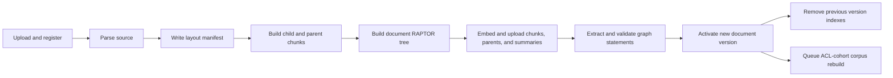
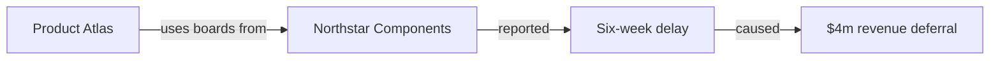

# Building an Ingestion Core for Advanced RAG

Small chunks are good at finding a sentence. They are much less useful when a
question asks for a whole-document theme or a relationship spread across
several reports. This project therefore turns each document into three
different views of the same evidence:

- searchable child chunks with larger parent context;
- hierarchical summaries used to navigate broad questions; and
- graph statements that connect named entities while retaining source
  provenance.

The source document and its lifecycle stay in PostgreSQL. Weaviate and Neo4j
are rebuildable indexes. That distinction is central to the design: an index
can be replaced without pretending it is the original record.

This article follows the implemented ingestion path. The next article,
[Beyond Vector Search](02-retrieval-for-multihop-questions.md), explains how
queries choose among the resulting search surfaces.

## The real ingestion path

An upload is registered as a `Document` plus an `IngestionJob`. The API hashes
the content before storing it, so an authorized duplicate can reuse an
existing document and job. A revision instead gets the same logical lineage,
a higher version, and a pending index status. These rules live in
[`backend/app/api/routes.py`](../../backend/app/api/routes.py) and
[`backend/app/repositories/postgres.py`](../../backend/app/repositories/postgres.py).

The worker then runs the stages in
[`backend/app/worker.py`](../../backend/app/worker.py):



The vector index is written before the graph. The new document becomes active
only after both indexing stages finish. If it replaces a revision, activation
marks the old record as superseded and the worker deletes the old Weaviate and
Neo4j entries. Finally, it requests a corpus-summary rebuild for the exact
tenant and ACL cohort.

Workers use PostgreSQL leases and retry failed jobs, but those mechanics are
not the interesting part of ingestion. The important property is that
activation is late: a partially indexed revision does not become the live
document.

It helps to separate the scope of each operation:

| Work | Scope | Trigger |
| --- | --- | --- |
| Parse, layout manifest, chunks, parent contexts | One document version | Ingestion job |
| Child, parent, and document-summary objects | One document version | Vector-index stage |
| Graph statements and entity links | One document version | Graph-index stage |
| Corpus summary tree | One tenant plus one exact ACL cohort | Queued after activation or deletion |
| Version switch and old-index cleanup | One document lineage | Successful revised-document ingestion |

The corpus rebuild is deliberately asynchronous with respect to document
activation. A newly active document can be found through its chunks before the
cohort's upper summary tree has caught up. That is a consistency trade-off:
direct lookup stays available, while broad synthesis may briefly navigate an
older corpus tree. Because final retrieval resolves navigation back to active
source chunks, stale summary entries do not become citable evidence.

## Parsing preserves structure without pretending to understand everything

Parsing is implemented in
[`backend/app/services/ingestion.py`](../../backend/app/services/ingestion.py).
It supports PDF, DOCX, PPTX, TXT, and Markdown.

For PDFs, PyMuPDF reads native text blocks in visual order. Each `TextBlock`
keeps:

- a one-based page number;
- the text;
- a bounding box; and
- a boolean heading signal.

A PDF block is treated as a heading when its largest font is at least 1.25
times the page's median text size and the block is no longer than 200
characters. This is a useful layout heuristic, not semantic chunking. It can
misread unusually styled text.

The parser also records figures and extracted tables as `LayoutArtifact`
objects. DOCX headings come from paragraph styles, DOCX tables are flattened
into pipe-separated rows, and the first short item on a PowerPoint slide is
treated as its heading. TXT and Markdown use paragraphs and only treat the
first short paragraph as a possible heading.

The complete manifest is saved beside the source as
`<object_key>.layout.json`. It contains page counts, pages without text,
blocks, coordinates, and artifacts. Source deletion removes the manifest too.
The manifest preserves information for later UI or parsing improvements; not
every artifact is directly searchable today.

There is deliberately no OCR. A wholly image-only PDF raises
`OCR_REQUIRED`. A partly scanned PDF records its textless page numbers but
indexes the pages that do contain native text. Failing loudly is better than
creating an apparently successful empty index.

There is also no dedicated repeated-header or footer removal. Exact parent
texts are deduplicated before parent embedding, but that is not the same as
detecting recurring page furniture. This is a visible place for future
parsing work.

## Small-to-big chunking

The chunker does not hand the text to a generic token splitter. It first
flattens body blocks into words carrying `(page, section, bbox)` provenance.
A heading updates the current section label and is not copied into body text.

It then creates sentence-safe windows:

- a parent is about 1,000 words;
- each parent contains children of about 200 words;
- a boundary moves backward to sentence-ending punctuation when possible; and
- there is no configured overlap.

The final child `Chunk` stores its own text, the full parent text, page,
section, and the first word's bounding box. Word counts are used, not model
tokens. The punctuation rule is intentionally simple and can be fooled by
abbreviations such as “Dr.”

Consider a fictional report section:

```text
Heading: Supply chain

Product Atlas depends on Northstar Components for control boards. In March
2025 Northstar reported a six-week delay. Management estimated a $4 million
revenue deferral...
```

If this section fills a 1,000-word parent, the sentence about the six-week
delay may appear in one 200-word child. Search ranks that small child, while
generation receives the larger parent through `Evidence.context_text`. The
citation still points to the child's page and section. This gives precise
matching without forcing the answer model to reason from an isolated sentence.

Weaviate stores child nodes and parent nodes, but normal search returns only
`nodeType="chunk"`. The child's `parentText` supplies the larger context.
During a rolling schema upgrade, retrieval retries without `parentText` if the
optional property does not yet exist.

## Representation 1: searchable chunks

`WeaviateIndexer` embeds every child and each distinct parent. It writes them
to the configured shared collection, which defaults to `FilingSection`.
Objects carry tenant, document, version, index version, ACL, node type, page,
section, source coordinates, and parent text.

Node IDs are deterministic UUIDs derived from index version, document ID,
document version, and the local node key. This makes a rebuild repeatable while
keeping two index versions or document revisions separate. Before uploading a
document's objects, the indexer deletes that document's objects for the same
index version. Batch responses are inspected for per-object failures; a
nominal HTTP success with rejected objects still fails the indexing stage.

Schema setup is rolling-upgrade aware. If the shared collection exists,
ingestion adds missing properties one at a time rather than recreating it.
Retrieval also tolerates a temporarily absent optional `parentText` field.
This matters because schema evolution and ingestion cannot be assumed to
happen in one atomic deployment.

Public documents use the internal ACL marker `__public__`, because the shared
collection cannot rely on null-state indexing. Authorization code translates
that convention back into public access semantics.

These chunks are the source evidence used in answers. Parent nodes and
summaries improve context or navigation, but the final grounded-claims prompt
may cite only evidence with `source_kind="source"`.

## Representation 2: hierarchical summaries

The RAPTOR implementation is in
[`backend/app/services/raptor.py`](../../backend/app/services/raptor.py).
It embeds child chunks, reduces dimensions with PCA when useful, and fits
Gaussian mixture models. BIC chooses the component count, while a probability
threshold allows soft membership in more than one cluster. Inputs larger than
the target cluster size are forced to consider at least two components, so
they actually produce another level.

Each cluster is summarized by the model. The node stores:

- summary text capped at 4,000 characters;
- its level and child IDs;
- the original chunk source IDs;
- page and section hints;
- its embedding; and
- whether it is the root.

Malformed or truncated model output falls back to an extractive excerpt for
that cluster. A summary with no meaningful vocabulary overlap with its source
also falls back to source text. This is a lightweight poisoning defense, not
a full entailment model.

Soft membership introduces an intentional cost: one chunk can contribute to
more than one cluster, which may create more summaries and repeated source
links. In return, a passage that discusses both supplier risk and launch
timing does not have to be forced into exactly one theme. Stable summary keys
are derived from sorted cluster membership rather than the GMM component
number, because component numbering can change between fits.

Document trees are built during each document's vector indexing. A separate
corpus rebuild takes document roots for one exact ACL cohort and builds upper
summary levels across them. Cohorts are hashed from the sorted group set;
public documents form their own cohort. This avoids creating a corpus summary
that mixes evidence visible to different audiences.

At query time, summaries are navigation only. A broad `synthesis` search ranks
summary nodes from any level in a collapsed-tree query, resolves their source
chunk keys, and then retrieves the actual chunks. Corpus nodes keep child IDs
rather than an unbounded list of all sources, so resolution is capped at six
hops.

This view helps with questions such as “How has management's risk position
changed across these reports?” A flat child search may return several locally
similar risk paragraphs without exposing the larger themes. Summary clusters
provide a compact route to the relevant source areas, while the answer still
rests on original chunks.

## Representation 3: a provenance-first graph

[`backend/app/services/graph_index.py`](../../backend/app/services/graph_index.py)
extracts up to 20 explicit subject-predicate-object statements from each
distinct parent text. A statement may also contain a date, but the prompt says
not to infer missing relationships.

Before persistence, both subject and object must have meaningful vocabulary
overlap with their source parent. A rejected statement never reaches Neo4j.
Accepted `Statement` nodes retain document ID, version, ACL, page, section,
source text, and index version. They connect to tenant-scoped `Entity` nodes
and to the source `Document`.

Entity names are embedded. Pairs above a cosine-similarity threshold of 0.92
receive provenance-scoped `SYNONYM_OF` edges. This supports alternate surface
forms while keeping the edge tied to the document and index version that
produced it.

Extraction runs once per distinct parent, not once per child. That reduces
duplicate model work and gives the extractor enough surrounding text to see a
complete explicit relationship. One failed parent extraction is skipped
rather than failing the whole document; the already-built vector index and
other parents' statements remain useful. This is graceful degradation, but it
also means graph coverage can be incomplete even when ingestion finishes.

Here is an illustrative graph, not repository data:



In the real graph, the relationships above would be separate `Statement`
nodes, each supported by a document and carrying its original paragraph.
Graph retrieval returns that source paragraph, not the synthetic triple. The
graph therefore helps discover a path without turning extracted structure
into citable truth.

## The trade-offs

| Representation | Best query type | Precision | Global context | Cross-document reasoning | Ingestion cost | Maintenance | Traceability |
| --- | --- | --- | --- | --- | --- | --- | --- |
| Flat token chunks | Local lookup | Medium | Low | Low | Low | Low | Medium |
| Structure-aware child + parent chunks | Local lookup with surrounding context | High | Medium | Low | Medium | Medium | High |
| Hierarchical summaries | Broad themes and corpus navigation | Medium until resolved to chunks | High | Medium | High | High | High through source IDs |
| Knowledge graph | Entity relationships and temporal/multi-hop discovery | High when extraction is sound | Medium | High | High | High | High through statements and source text |

No one representation wins every row. This ingestion core pays extra model,
embedding, and maintenance cost to create several useful search surfaces.
Ingestion still does not answer a question. Retrieval must decide which
surface to use, protect its authorization boundary, and reject weak evidence.
That is the subject of [part two](02-retrieval-for-multihop-questions.md).
