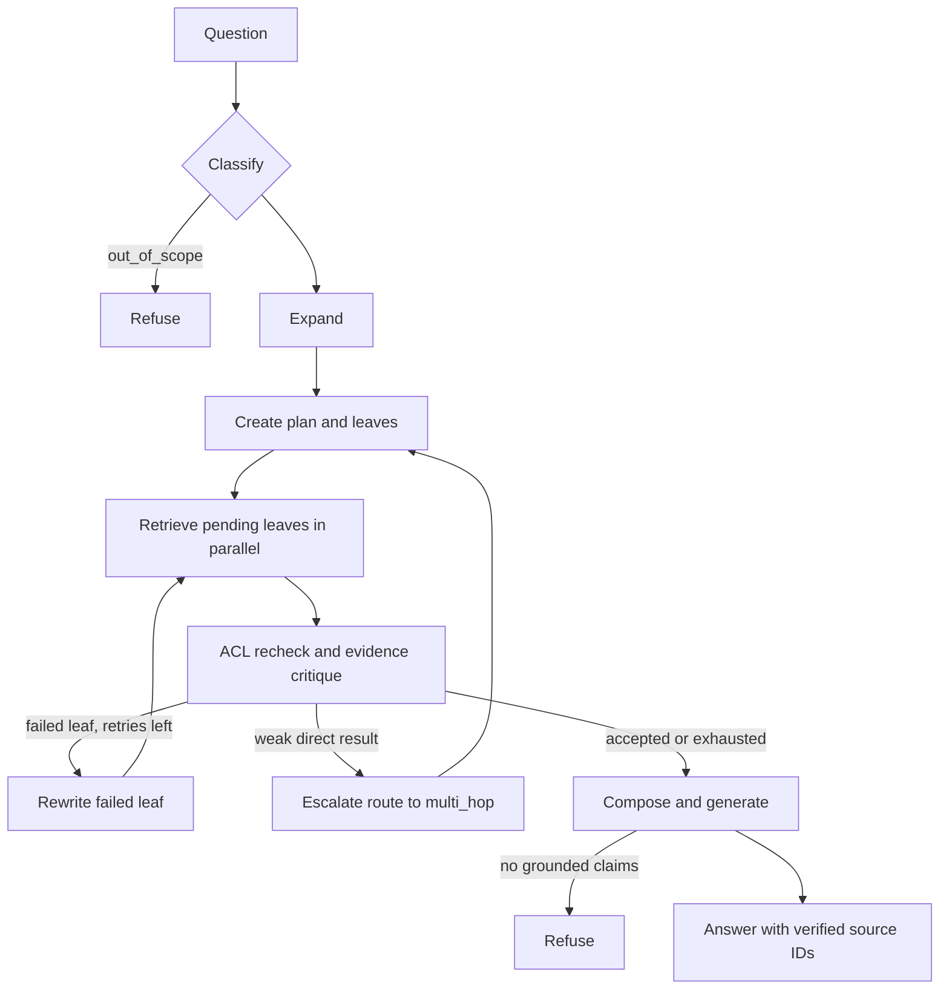

# Beyond Vector Search: Retrieval Planning for Multi-Hop Questions

[Part one](01-building-the-ingestion-core.md) created chunks, summary trees,
and graph statements. The next problem is selection. A revenue lookup should
not pay for a graph walk, while a relationship question should not be forced
through one vector search.

This repository handles that choice with routing, optional decomposition,
layered retrieval, evidence grading, and two recovery paths. It is more capable
than a static vector pipeline, but its current limits matter as much as its
features.

## Six questions, six intended behaviours

The `Route` enum in
[`backend/app/schemas/domain.py`](../../backend/app/schemas/domain.py) contains
`direct`, `synthesis`, `comparison`, `temporal_causal`, `multi_hop`, and
`out_of_scope`.

| Question | Likely route | Retrieval behaviour |
| --- | --- | --- |
| “What was revenue in 2025?” | `direct` | Hybrid chunk search, reranking, at most two accepted contexts |
| “How did risk factors differ in the 2024 and 2025 reports?” | `comparison` | Planned leaf searches over chunks |
| “When did management first call supplier concentration material?” | `temporal_causal` | Planned searches plus vector and graph retrieval |
| “Which supplier is linked to the delayed launch, and what impact was reported?” | `multi_hop` | Planned searches plus vector and graph retrieval |
| “What are the main strategic risks across the reports?” | `synthesis` | Summary-tree navigation followed by source-chunk retrieval |
| “What will the share price be next month?” | Usually an in-corpus route, then refusal | Refusal happens when authorized supporting evidence is absent |

The last row is easy to misunderstand. `out_of_scope` is reserved mainly for
instruction override or harmful requests. A normal but unanswerable question
is not expected to be routed there; it is refused later when evidence or
grounded claims are missing.

## Routing and expansion share one model call

The first classifier is the small keyword function in
[`backend/app/agents/adaptive_router.py`](../../backend/app/agents/adaptive_router.py).
Its literal triggers provide a deterministic fallback. Its default is
`direct`, which is also the route most likely to hide unfamiliar real-world
phrasing.

For that reason, `_classify` in
[`backend/app/services/rag_pipeline.py`](../../backend/app/services/rag_pipeline.py)
always asks the model for a second opinion when a model is configured. The
`router-expansion:v1` prompt returns the route, an expanded query, and at most
20 predicted source terms in one structured response:

```json
{
  "route": "temporal_causal",
  "expanded_query": "management supplier concentration material risk first identified date",
  "terms": ["supplier concentration", "material risk", "management"]
}
```

The prompt gives special attention to multiple named sources, temporal versus
static comparison, and identifying an unknown entity from indirect clues.
These rules and few-shot examples are visible in
[`backend/app/prompts/templates.py`](../../backend/app/prompts/templates.py).

If the model returns malformed JSON, the node logs `fallback_used` and keeps
the keyword route. Structured-output failure does not restart the durable
chat run. For non-direct routes that did not already receive an expansion,
`expand` makes a separate model call; otherwise the original query is used.
Expansion is retrieval vocabulary only and may never be cited as evidence.

The evaluation retrospective records an older 16.7% keyword baseline, an
approximately 82% intermediate double-check result, and later prompt work that
reached roughly 95% in live sampled runs. Those are experiment records, not a
guarantee for a new corpus or provider. The committed gate in
[`evaluation/thresholds.json`](../../evaluation/thresholds.json) requires 90%
route accuracy.

## The prompt contracts, in shortened form

All prompt text is versioned in
[`backend/app/prompts/templates.py`](../../backend/app/prompts/templates.py)
and looked up through `prompt("<name>:v1")`. The following are faithful
abbreviations, not complete copies.

**Routing plus expansion**

```text
Input: <question>...</question>
Task: choose exactly one of direct, synthesis, comparison,
      temporal_causal, multi_hop, out_of_scope.
Output: {"route":"string","expanded_query":"string","terms":["string"]}
Rule: predicted terms are retrieval vocabulary, never evidence.
```

The `RoutingExpansion` schema restricts route to the six enum values. A parse
or provider failure leaves the deterministic keyword classification in place.

**Standalone query expansion**

```text
Input: <question>...</question>
Task: predict words likely to appear in a correct source.
Output: {"expanded_query":"string","terms":["string"]}
Limit: 20 terms; do not answer the question.
```

The `QueryExpansion` schema caps the query at 2,000 characters. Failure returns
the original user query.

**Reasoning plan**

```text
Input: <question>...</question>
Task: separate known entities, unknown entities, and independently
      answerable leaves; dependencies must name leaf IDs.
Output: {"known_entities":[],"unknown_entities":[],
         "leaves":[{"id":"snake_case","question":"...","depends_on":[]}]}
Limit: 8 leaves.
```

Pydantic verifies unique IDs and existing dependency references. The prompt
asks for an acyclic plan, but the schema itself does not run a cycle check.
Failure uses the heuristic decomposer.

**Evidence grading**

```text
Input: leaf question plus candidate ID and source text.
Task: accept only text that explicitly supplies a needed data point.
Output: {"decisions":[
  {"evidence_id":"existing-id","accepted":true,"reason":"under 8 words"}]}
```

The code never trusts invented IDs: only decisions keyed to actual candidate
IDs can affect grading. Failure uses the lexical grader.

**Leaf rewrite**

```text
Input: failed question plus rejection reasons.
Task: rewrite for retrieval; add no facts and do not answer.
Output: {"expanded_query":"string","terms":[]}
```

Failure uses the deterministic rewrite helper, and the result remains
non-citable search text.

**Answer generation**

```text
Input: original question plus accepted <evidence> spans carrying exact IDs.
Task: write atomic claims stated by a single span; do not infer a link
      merely because two separate facts are true.
Output: {"claims":[{"text":"...","evidence_ids":["source-id"]}],
         "unsupported":["..."]}
```

The `GroundedAnswer` schema can hold up to 30 claims, although the prompt asks
the model for at most eight. A parse failure here does not fall back to
uncurated prose: with a configured model, generation refuses.

## Planning: the schema is stronger than the scheduler

Comparison, synthesis, temporal, and multi-hop routes can ask the model for a
`ReasoningPlan`. Direct queries use a single deterministic leaf. The schema in
[`backend/app/schemas/agent.py`](../../backend/app/schemas/agent.py) allows up
to eight leaves:

```json
{
  "known_entities": ["Product Atlas"],
  "unknown_entities": ["supplier", "reported financial impact"],
  "leaves": [
    {
      "id": "supplier_lookup",
      "question": "Which supplier was linked to the Product Atlas delay?",
      "depends_on": []
    },
    {
      "id": "impact_lookup",
      "question": "What financial impact was reported for the Product Atlas delay?",
      "depends_on": ["supplier_lookup"]
    }
  ]
}
```

IDs must be unique snake-case strings, dependencies must name existing leaves,
and the prompt asks for an acyclic bottom-up plan. If parsing fails, the
fallback decomposer uses simple conjunction splitting for comparison,
temporal, and multi-hop routes.

There is an important implementation gap: the current `_retrieve` method
selects every pending leaf and launches it with `asyncio.gather`. It records
`depends_on`, but does not wait for a dependency or substitute an intermediate
answer into a downstream query. The JSON above is schema-valid, yet both
leaves currently search in parallel. The project supports parallel
multi-question retrieval, not a fully dependency-aware executor.

## The layered retriever

The production stack is assembled in
[`backend/app/components/hybrid_retriever.py`](../../backend/app/components/hybrid_retriever.py):

```text
ActiveDocumentRetriever(
  CachedRetriever(
    RerankingRetriever(
      CompositeRetriever(
        WeaviateRetriever,
        Neo4jRetriever))))
```

Read this from the inside out.

`WeaviateRetriever` performs hybrid BM25 and vector search with `alpha: 0.5`.
Tenant, index version, allowed groups, and `nodeType` are in the datastore
filter before ranking. Public content matches `__public__`. For `synthesis`,
it first ranks summary nodes, resolves their source keys, and then searches
only source chunks. Summary text is never returned as answer evidence.

`Neo4jRetriever` participates only for `multi_hop` and `temporal_causal`.
Its Cypher first restricts `Statement` nodes by tenant, index version, and ACL,
then expands through their entities and authorized synonym edges. Lexical
terms seed the walk. When they find nothing, query/entity embedding similarity
can supply seeds. Personalized PageRank ranks the returned
statement-entity subgraph, but the resulting `Evidence.text` is the original
source paragraph.

`CompositeRetriever` runs graph and vector retrieval concurrently for those
two complex routes and merges by score. Comparison still uses Weaviate alone.
`RerankingRetriever` then uses the configured Voyage reranker and limits the
result to at most 20 candidates.

`CachedRetriever` uses Redis for five minutes. Its SHA-256 key includes index
version, tenant, sorted groups, route, query, and limit. A cache hit therefore
cannot cross an ACL context.

Finally, `ActiveDocumentRetriever` checks candidate document IDs against the
canonical store. It drops deleted, superseded, or newly unauthorized records.
If filtering starves a full result page, it performs one search at twice the
limit and filters again. This final gate matters because index deletion and
permission changes are not necessarily instantaneous.

Authorization is checked again in `critique` by
[`backend/app/security/content_filter.py`](../../backend/app/security/content_filter.py).
Only source evidence with a public or intersecting ACL survives. The tenant
argument is not inspected there because `Evidence` does not carry tenant ID;
tenant isolation depends on datastore filtering and active-document
revalidation. That division is worth knowing during security review.

## Retrieval and repair flow



The total retrieval budget defaults to 30 calls. Pending leaves beyond the
remaining budget become `exhausted`. Each selected leaf increments its own
attempt count before retrieval.

## What “critique” means here

The critic prompt asks whether each candidate explicitly supplies a data point
needed by its assigned leaf. Its structured contract is intentionally small:

```json
{
  "decisions": [
    {
      "evidence_id": "source-id",
      "accepted": false,
      "reason": "supplier is not identified"
    }
  ]
}
```

This is not a formal taxonomy of relevant, sufficient, contradictory,
incomplete, unsupported, and permission-safe evidence. It is binary
accept/reject plus a short reason. Permission safety is handled before the
model. When no critic runs—or its output is malformed—the fallback grader in
[`backend/app/agents/document_grader.py`](../../backend/app/agents/document_grader.py)
uses lexical overlap and score ordering.

For direct queries, at most two items are accepted. Other routes allow the
configured `max_evidence_per_leaf`, currently eight. A direct route whose best
accepted score remains below `direct_confidence_threshold` (0.55) is changed
to `multi_hop`, its evidence is cleared, and a new plan is created.

## Rewrite only the failed leaves

A failed leaf with retry budget left enters `rewrite`. The shortened prompt
contract is:

```text
Input:
Question: What caused the launch delay?
Rejected because: ['multiple delays; product not identified']

Output:
{"expanded_query":
 "Product Atlas launch supplier event announced delay",
 "terms":[]}
```

The model may use only the question and rejection reasons; the rewrite is
search text, not evidence. If the call fails or the model budget is exhausted,
[`backend/app/services/query_rewriter.py`](../../backend/app/services/query_rewriter.py)
adds a deterministic `evidence attempt N` suffix.

`max_leaf_retries=2` means two retries after the initial search. After the
third failed retrieval, the leaf remains `failed` but is no longer retryable.
By contrast, a pending leaf that cannot fit inside the total retrieval-call
budget is explicitly marked `exhausted`. Other accepted leaves remain in
state, so the pipeline does not throw away useful work.

## From accepted evidence to an answer

`compose` deduplicates evidence by ID and groups it by document. During
generation, identical parent contexts within a group are shown once.

The `grounded-claims:v1` prompt requires atomic claims, each explicitly stated
in one source span. It forbids creating a connection merely because two
separate facts are true. Its output maps each claim to exact evidence IDs:

```json
{
  "claims": [
    {
      "text": "Northstar reported a six-week delay.",
      "evidence_ids": ["source-17"]
    }
  ],
  "unsupported": ["No source states the final financial impact."]
}
```

Code then verifies that every referenced ID belongs to accepted evidence and
that every cited item is a source, not a summary or triple. Valid claims are
rendered with numbered citations. If a configured model returns malformed
output or cites outside the accepted set, the pipeline refuses. Direct
numbered source excerpts are used only when no model is configured at all.

The zero-claim branch deserves special mention. Python's `all()` returns true
for an empty list, so an answer with no claims could otherwise pass citation
validation vacuously. The implementation detects this, returns a refusal, and
includes the model's `unsupported` reasons.

The result is an adaptive retrieval pipeline with conservative generation.
It becomes an agentic system when these choices, loops, budgets, checkpoints,
and stopping rules are treated as explicit state. [Part three](03-turning-rag-into-an-agentic-system.md)
walks through that state machine.
