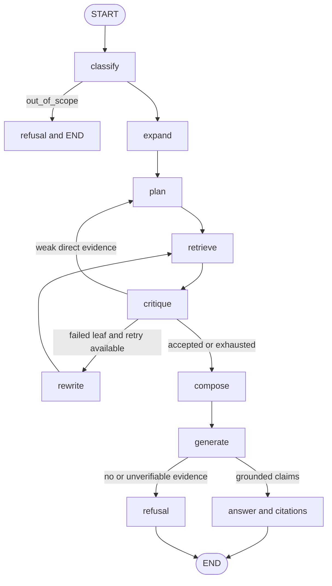

# From Advanced RAG to Agentic RAG

Advanced retrieval is a collection of techniques. Agentic retrieval is a
control system around those techniques.

In this repository, “agentic” does not mean “RAG plus an LLM.” It means the
system keeps explicit state, chooses a route, builds a plan, calls retrieval
tools, inspects evidence, repairs individual failures, changes strategy when
needed, enforces budgets, verifies citations, checkpoints progress, and ends
in either an answer or a refusal.

[Part one](01-building-the-ingestion-core.md) described the knowledge
representations. [Part two](02-retrieval-for-multihop-questions.md) described
retrieval. This final article uses
[`backend/app/services/rag_pipeline.py`](../../backend/app/services/rag_pipeline.py)
as the backbone that joins them.

## The LangGraph is the product logic



`AgentState` in
[`backend/app/schemas/domain.py`](../../backend/app/schemas/domain.py) carries
the question, identity, route, expansion, plan, leaf states, attempts,
accepted evidence, model and retrieval counts, escalation flag, answer,
citations, and quality counters.

The nodes have focused jobs:

| Node | Reads | Does | Fallback and next steps |
| --- | --- | --- | --- |
| `classify` | Query and identity state | Keyword route, then structured route plus expansion | Malformed model output keeps keyword route; `out_of_scope` ends immediately |
| `expand` | Route and query | Produces retrieval vocabulary for non-direct routes | Uses original query; then `plan` |
| `plan` | Route and query | Creates `ReasoningPlan` and fresh leaf states | Heuristic decomposition; then `retrieve` |
| `retrieve` | Pending leaves, auth, budget | Runs selected leaf retrievals concurrently | Over-budget leaves become exhausted; then `critique` |
| `critique` | Candidates, route, ACL | Rechecks authorization and accepts or rejects evidence | Lexical grader if needed; then repair, escalation, or composition |
| `rewrite` | Failed leaves and rejection reasons | Rewrites only failed search queries | Deterministic suffix; then `retrieve` |
| `compose` | Accepted leaf evidence | Deduplicates IDs and groups sources by document | Then `generate` |
| `generate` | Question, route, grouped source evidence | Produces atomic claim-to-source mappings | Refuses on missing, empty, malformed, or invalidly cited model output |

Most structured model calls catch parse, validation, and provider errors and
fall back inside their node. The final grounded-answer call is different: its
JSON parse is guarded, but a transport failure propagates so the durable run
can be retried. This avoids quietly turning a provider outage into an
apparently authoritative response.

## Two correction loops

### Local repair

```text
retrieve → critique → rewrite failed leaf → retrieve
```

Suppose a two-leaf comparison finds good 2024 evidence but poor 2025 evidence.
The accepted 2024 leaf stays in state. Only the failed leaf receives a new
query based on the critic's rejection reason. This bounds cost and avoids
introducing needless variation into work that already succeeded.

Each leaf gets one initial search and at most two retries. The total request
also has a 30-retrieval-call ceiling. A leaf that cannot be scheduled within
that total becomes exhausted and cannot keep the graph alive forever.

### Strategy escalation

```text
direct retrieve → weak confidence → re-plan as multi_hop
```

This is different from paraphrasing. When a supposedly direct lookup returns
no accepted item above 0.55, `critique` changes the route to `multi_hop`,
clears the weak evidence, and goes back to `plan`. The system is admitting
that its original strategy may have been wrong.

The escalation state is also explicit in run metrics. It can be measured
rather than inferred from logs.

## A worked example

Use fictional documents and ask:

> Which supplier was connected to the Product Atlas delay, and what financial
> impact did the documents report?

### 1. Guard and route

`validate_query` collapses whitespace and enforces a 20,000-character limit.
Identity is already an `AuthContext` containing subject, tenant, and groups.
The router sees two linked unknowns and returns:

```json
{
  "route": "multi_hop",
  "expanded_query": "Product Atlas launch delay supplier reported financial impact",
  "expansion_terms": ["Product Atlas", "supplier", "delay", "financial impact"],
  "model_calls": 1
}
```

The question is wrapped in `<question>` and prompts call it untrusted content.
This is prompt hygiene, not the access-control boundary.

### 2. Plan

The structured plan could be:

```json
{
  "known_entities": ["Product Atlas"],
  "unknown_entities": ["supplier", "financial impact"],
  "leaves": [
    {
      "id": "find_supplier",
      "question": "Which supplier was linked to the Product Atlas delay?",
      "depends_on": []
    },
    {
      "id": "find_impact",
      "question": "What financial impact was reported for the Product Atlas delay?",
      "depends_on": ["find_supplier"]
    }
  ]
}
```

The model and schema express the dependency. The current executor does not
honour it: both pending leaves run in parallel and no intermediate supplier
answer is inserted into `find_impact`. This trace therefore demonstrates
parallel leaf retrieval, not true dynamic hop-by-hop execution.

### 3. Layered retrieval

For each leaf, the composite retriever runs Weaviate and Neo4j concurrently.
Weaviate searches child chunks with both keywords and embeddings. Neo4j
restricts statements by tenant and ACL before graph expansion, ranks the
authorized subgraph with personalized PageRank, and returns source paragraphs.

One abbreviated leaf state might be:

```json
{
  "id": "find_supplier",
  "attempts": 1,
  "status": "retrieved",
  "candidates": [
    {
      "id": "src-17",
      "document_title": "Atlas Operations Review",
      "text": "Northstar Components notified the team of a six-week delay.",
      "page": 8,
      "section": "Launch dependencies",
      "source_kind": "source"
    }
  ]
}
```

The retrieval cache key includes tenant and group membership. Outside the
cache, the datastore filters include the same identity. After reranking,
`ActiveDocumentRetriever` asks PostgreSQL whether each document remains
active and visible.

### 4. Critique and local repair

Assume the supplier leaf is accepted, but the impact leaf retrieves a generic
revenue outlook. Its state becomes:

```json
{
  "id": "find_impact",
  "attempts": 1,
  "status": "failed",
  "rejection_reasons": ["delay-specific impact is not stated"]
}
```

`rewrite` asks for a retrieval-only reformulation. It might produce
`"Product Atlas six-week launch delay revenue deferral charge impact"`.
Only this leaf searches again. On the second attempt it finds a source span
stating that management expected a $4 million revenue deferral.

### 5. Composition and generation

`compose` deduplicates evidence IDs and groups them by source document.
Generation replaces duplicate child text with shared parent context only once.
The pro model is selected for `multi_hop` and `temporal_causal` final
grounding; other routes use the flash model. Both model names are settings,
currently MiniMax M2.7-highspeed and MiniMax M3, called through
`langchain-litellm` in
[`backend/app/components/llm.py`](../../backend/app/components/llm.py).

The model must return atomic claims:

```json
{
  "claims": [
    {
      "text": "Northstar Components reported the Product Atlas delay.",
      "evidence_ids": ["src-17"]
    },
    {
      "text": "Management expected a $4 million revenue deferral.",
      "evidence_ids": ["src-29"]
    }
  ],
  "unsupported": []
}
```

Code verifies that both IDs are accepted source evidence. It then creates
`Citation` records containing document title, excerpt, page, and section, and
renders numbered references.

Notice what it does not prove: unless a source explicitly states that
Northstar's delay caused the $4 million deferral, generation may not invent
that connection from the two separate claims. The prompt must put an unstated
connection in `unsupported`. If it returns no claims, the zero-claim branch
refuses and reports what was missing.

## Bounded autonomy

The aim is adaptive but bounded, not autonomous but unbounded.

The default settings in
[`backend/app/core/config.py`](../../backend/app/core/config.py) enforce:

- at most 30 model calls recorded in agent state;
- at most 30 leaf retrieval calls;
- at most two retries after a leaf's initial retrieval;
- at most eight plan leaves;
- at most 100 initial retrieval candidates;
- at most 20 reranked candidates; and
- at most eight accepted evidence items per non-direct leaf, or two for direct.

There is a nuance in the model-call limit. Nodes check the budget before most
optional calls, but `classify` calls the configured model without consulting
`_has_model_budget`, and final generation is also necessary once evidence
exists. The ceiling therefore bounds the iterative optional work more directly
than it acts as a universal gateway around every possible call.

Malformed structured output normally falls back within the current node.
Retries are counted per leaf question. Exhausted leaves are not selected
again. The graph has no open-ended tool-selection loop, so every route reaches
composition, refusal, or an error handed back to the durable job system.

Tokens and estimated dollar cost are accumulated by `LiteLLMGateway`.
Completed chat runs store duration, route, confidence, model calls, retrieval
calls, citation counts, grounding counters, escalation, token usage, cost,
model names, and index version.

## Durability is part of correctness

A chat request is a PostgreSQL-backed `ChatRun`. A worker claims it with a
lease and passes the run ID as LangGraph's `thread_id`. The
`AsyncPostgresSaver` checkpointer is created and set up when the worker starts,
so node state is durable.

If a worker fails, the run is queued again until its third attempt; another
worker can reclaim an expired lease. Redis publishes progress and token
events, but it is not the source of truth. If Redis is unavailable, the worker
continues polling PostgreSQL and the final run record remains durable.

This is intentionally brief infrastructure detail with a reasoning purpose:
a long-running agent must not lose its accepted evidence and retry state
because one process disappeared.

## Security travels with the state

Tenant, user, and groups enter `AgentState` at the start and are rebuilt into
`AuthContext` for every retrieval. The same identity influences:

- Weaviate's pre-ranking tenant and ACL filters;
- Neo4j's statement filters before any entity traversal;
- permission-scoped cache keys;
- the active-document query against PostgreSQL;
- the pre-generation source-evidence filter; and
- tenant-tagged citations and stored run records.

The public vector-search tool also requires an explicit `AuthContext`; there
is no identity-free search signature in
[`backend/app/tools/vector_search.py`](../../backend/app/tools/vector_search.py).
The repository has no MCP server, so it should not be described as an MCP
implementation.

Prompt injection is treated separately from authorization. Prompts label
questions and document text as untrusted. RAPTOR summaries and graph subjects
and objects must overlap their own source text or fall back/be rejected.
These are useful heuristics, not proof against every poisoned document.
Crucially, an LLM never gets to widen the tenant or group filter.

[`backend/app/security/output_filter.py`](../../backend/app/security/output_filter.py)
contains a small helper that checks whether rendered citation numbers fall
inside a source list, and it has unit coverage. The production grounded-claim
path does not call that helper. It performs the stronger check directly in
`RagPipeline`: every claim needs at least one evidence ID, every ID must be in
the accepted set, and only `source` evidence can become a citation. This
distinction avoids presenting a tested utility as a wired runtime guard.

## Observability and evaluation

LangChain/LangGraph calls can flow to LangSmith with prompt version, index
version, model tags, and a sensitive-content flag. By default,
`LiteLLMGateway` sets LangChain to hide inputs and outputs unless
`allow_sensitive_tracing` is enabled.

Phoenix/OpenTelemetry support is optional. When enabled, OpenInference is
configured to capture prompts and responses in full. That is a real
difference from the default-hidden LangSmith path and needs a deliberate
privacy decision before production use. Worker spans cover parsing, chunking,
vector indexing, and graph indexing.

The evaluation assets test routes, retrieval recall, generation grounding,
citations, refusals, and route-specific latency. Committed thresholds require:

| Measure | Gate |
| --- | ---: |
| Route accuracy | 0.90 |
| Retrieval recall at 20 | 0.85 |
| Grounded-claim rate | 0.95 |
| Citation validity | 0.99 |
| Refusal accuracy | 0.90 |
| Direct p95 | 3.5 seconds |
| Synthesis p95 | 10 seconds |
| Complex p95 | 30 seconds |

[`evaluation/runtime_report.py`](../../evaluation/runtime_report.py) reports
production run aggregates from PostgreSQL, including p95 latency, grounding,
citations, critic acceptance, calls, and cost.
[`evaluation/query_latency.py`](../../evaluation/query_latency.py) exercises
the API and event path. The MultiHop-RAG-derived assets widen the question and
corpus shapes beyond hand-written fixtures.

A stateful agent needs this wider evaluation surface. Retrieval recall alone
cannot reveal a routing regression, an infinite repair loop, a vacuous
zero-claim success, an unauthorized cache hit, or a citation outside the
accepted set.

## Naive, advanced, and agentic RAG

| Concern | Naive RAG | Advanced RAG | This Agentic RAG |
| --- | --- | --- | --- |
| Query handling | One search query | Routing and expansion | Explicit route, plan, critique, rewrite, escalation |
| Retrieval | Vector top-k | Hybrid, summaries, graph, reranking | Those layers selected by state transitions |
| Multi-hop | Incidental | Decomposed searches | Parallel leaves and graph assistance; dependency execution remains incomplete |
| Correction | None | Optional retry | Per-leaf repair plus route escalation |
| Grounding | Prompt instruction | Reranked context | Atomic claim-to-accepted-source IDs |
| Refusal | Model discretion | Evidence threshold | Explicit no-evidence, zero-claim, and unverifiable branches |
| State | Request-local | Request-local metadata | Typed LangGraph state and PostgreSQL checkpoints |
| Cost control | Top-k | Route tuning | Call budgets, retry limits, evidence caps, cost metrics |
| Recovery | Restart request | Usually restart | Durable job lease and checkpointed graph |
| Evaluation | Answer examples | Retrieval and generation | Full decision graph, safety, latency, and run metrics |

## What this architecture proves—and what it does not

The repository demonstrates several reusable ideas: build multiple
provenance-linked representations; filter before ranking and again before
generation; use summaries and triples for navigation rather than citation;
repair only failed work; make escalation explicit; checkpoint reasoning; and
refuse when claim-to-source mapping cannot be verified.

It does not demonstrate a fully dependency-aware planner, OCR, sophisticated
header/footer removal, formal entailment for extracted facts, or a universal
contradiction model. Corpus summaries are rebuilt per exact ACL cohort, which
can become expensive as permission combinations grow. Neo4j entity seeding
loads a bounded set of candidate embeddings, and Weaviate summary resolution
has fixed limits. Those choices will need revisiting for much larger corpora.

Stricter production environments would also need stronger poisoned-document
testing, explicit privacy controls for every tracing backend, operational
proof under provider and datastore failures, and evaluation data matched to
the company's real documents and authorization patterns.

This is not a universally optimal architecture. It is a concrete example of a
useful design stance: let the agent adapt, but keep its evidence, authority,
cost, recovery, and stopping conditions outside the model's discretion.
