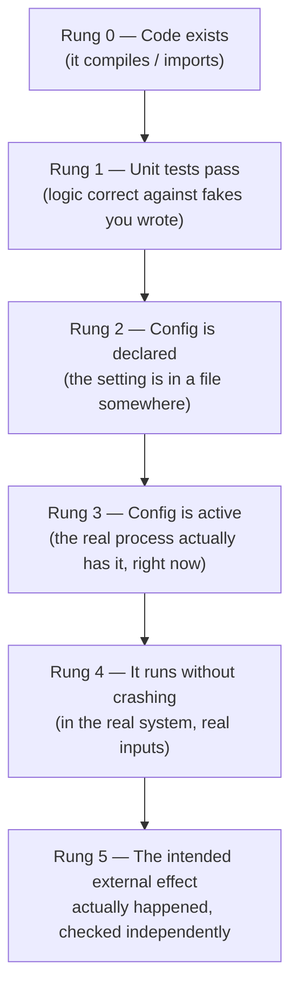

# Verification Gaps: Learning Lab

*Why "the tests pass" and "it's configured" are weaker claims than they feel like, and how to
close the gap with evidence — grounded in real bugs found while hardening an agentic RAG system.*

## Learning goal and assumptions

By the end of this lab you should be able to:

1. Name the specific claim each level of "I checked it" actually proves, and predict what kind
   of bug survives each level undetected.
2. Explain, from first principles, why `all(condition(x) for x in [])` is `True`, and design a
   check that doesn't fall into that trap.
3. Explain why two things that both look like "the config is loaded" can behave completely
   differently, and know which one you actually need.
4. Run a live-evaluation iteration loop (propose change → measure full breakdown → keep or
   revert) without fooling yourself when an aggregate number looks better but isn't.

**Assumptions about you:** you're comfortable reading Python, you've written unit tests with
mocks/fakes, and you've used at least one config-from-env-file library (Pydantic settings,
`dotenv`, Rails-style `.env`, etc.) — even if you've never thought hard about exactly what it
does to the process environment. No RAG or LLM background is assumed; the two RAG-specific
microworlds are self-contained.

## Why this matters

Every one of the bugs this lab is built from shipped with a green test suite and a
plausible-looking config file. None of them were "someone was careless" bugs — the code was
reasonable, the tests were reasonable, the config was reasonable. Each one is a case where a
*true* statement ("the unit tests pass," "the setting is in `.env`") was silently substituted for
a *different, stronger* statement ("this behavior works in production," "this setting is active")
that nobody had actually checked. The gap between those two statements is where these bugs live,
and it's a gap you will keep re-encountering under a different disguise for the rest of your
career — connection pools, feature flags, cache invalidation, retry policies, all have the same
shape. Learning to *see* the gap, rather than the specific bug, is the transferable skill here.

## Background

Four short facts you need before the microworlds land:

- **Python's `all()`** returns `True` for an empty iterable. This isn't a bug or a quirk — it's
  the correct vacuous truth from formal logic ("all elements of the empty set have property P"
  is true for any P, because there's no counterexample). `all([])` returning `False` would
  actually be the inconsistent choice.
- **Python's `logging` module** has a "handler of last resort": if no handler has been configured
  anywhere in your process, `logging` still doesn't crash or go fully silent — it falls back to a
  bare-bones handler that only prints `WARNING` and above. Below `WARNING` (`INFO`, `DEBUG`) is
  dropped with no error, no exception, nothing.
- **A settings library that reads `.env`** (Pydantic's `BaseSettings`, and most equivalents) does
  *not*, by default, copy those values into `os.environ`. It parses the file straight into its
  own Python object's fields. Any other code that reads `os.environ` directly — which is exactly
  how most third-party SDKs check for their own config, since they can't import your app's
  settings class — never sees those values unless something explicitly puts them there.
- **A mocked/faked test** replaces a real collaborator (a database, an LLM client, another
  service) with a stand-in that behaves the way *you* wrote it to behave. This is enormously
  valuable for testing your own logic in isolation — and it means the test can only ever be as
  realistic as your mental model of the collaborator's real behavior, including its real failure
  modes (truncated responses, empty results, network errors) that you may not have thought to
  simulate.

## Intuition first

Think of "verifying something works" as a **ladder**, not a light switch. Each rung is a
different, stronger claim:



Standing on a low rung feels almost identical to standing on a high one — the view from rung 1
("tests are green") and the view from rung 5 ("this actually works") both feel like relief and
closure. That's exactly what makes this dangerous: nothing *tells* you which rung you're on. You
have to deliberately check.

**The one-sentence version of every bug in this lab:** someone (reasonably) treated a low rung as
proof of a high rung.

## Where the analogy breaks

The ladder suggests you always climb rung by rung, in order — you don't. In the real story this
lab is based on, the LangSmith tracing bug was caught by jumping straight to rung 3 (checking
`os.environ` directly) and rung 5 (querying the LangSmith API for real traces) *without* ever
fully confirming rung 2 was insufficient in some other way — the jump itself was the fast,
correct move. Don't read "climb the ladder" as "always do all five steps in order for everything
you touch" — that's how you'd never ship anything. Read it as: **before you rely on a claim,
know which rung it's actually resting on**, and jump straight to whichever rung actually answers
your question. The ladder is a map for finding gaps, not a mandatory checklist.

## Formal model

For each rung, here's the specific *class* of bug that a lower rung cannot detect, with the case
study it maps to:

| Rung reached | What it proves | What can still be wrong | Case study |
|---|---|---|---|
| 1 (mocked unit tests pass) | Your logic is correct *given your model of the collaborator* | Your model of the collaborator is wrong, or doesn't cover a boundary case (e.g. empty input) | `all([])` bug; ingestion missing a `try/except` the query path had |
| 2 (config declared) | The value exists in a file you control | Nothing reads that file at the moment that matters, or reads a different name for it | LangSmith tracing silently off for host-run scripts |
| 3 (config active in *a* process) | The value is a real environment variable right now | It's active in the process you checked, not necessarily the one that matters | Same bug — Docker container had it, the host shell script didn't |
| 4 (runs without crashing) | No exception was raised on this input | The correct-looking output may still be silently wrong (wrong branch taken, wrong log level, no error to see) | Logging-never-configured bug: nothing crashed, nothing printed either |
| 5 (verified against independent evidence) | The externally observable effect actually happened | — this is the rung that actually answers "does it work" | Querying the LangSmith API directly; grepping live container logs |

A second, separate axis — not about verification depth but about *how you iterate once you can
measure rung 5* — matters just as much for the prompt-tuning story:

> **Aggregate-metric blindness.** A single number going up can hide one category getting worse.
> Always look at the full breakdown (a confusion matrix, a per-category table) before trusting
> that a change was actually an improvement.

> **Plateau vs. wrong lever.** If a class of fix (e.g. "add one more rule to the prompt") keeps
> trading one failure mode for another instead of converging, that's a signal you're pulling the
> wrong lever, not that you need to pull it harder.

## Worked example

**The refusal-accuracy bug, read through the ladder.** A RAG system was asked compound questions
like *"Does a BBC article on X and a Times of India article on Y show connection Z?"* where Z was
never actually stated anywhere. The system should refuse. It didn't. Three causes stacked:

1. **Routing bug** (rung 1 gap): a keyword classifier defaulted ambiguous queries to a fast
   `direct` path that had no LLM-based fact-checking. Unit-testable and was unit-tested — but the
   test fixtures happened not to include the exact shape of query that triggered the default.
   *Fixing this alone did not fix the user-visible symptom* — refusal accuracy didn't move.
2. **Evidence-critic bypass**: once routed correctly, a second LLM step accepted evidence for
   "X is true" and "Y is true" separately — both individually correct — without ever checking
   whether the *combination* Z was stated anywhere.
3. **Generation-time fabrication**: the final answer-writing step, given two true-but-separate
   facts, synthesized a plausible-sounding connection between them and cited the real (but
   insufficient) evidence IDs — passing a rung-4 check ("do the cited IDs exist and are they
   authorized?") while failing the rung-5 question ("does the evidence actually say this?").
4. **The vacuous-truth bug**, underneath all three: when the prompt was fixed to correctly return
   *zero* claims for an unanswerable question, the code path that decided "is this a valid,
   grounded answer?" used `all(check(c) for c in claims)` — which is `True` for an empty list —
   so a correct refusal was silently repackaged as a successful, empty, "grounded" answer instead
   of the pipeline's actual refusal message.

Each fix moved a different rung. Only after all four were fixed did the rung-5 metric (does the
system actually refuse when it should?) move from 10% to 100%. **This is the pattern to
internalize: a stack of independently-sufficient causes each needs its own fix, and you can only
tell you're done by re-measuring rung 5 after every single one.**

## Microworld 1: the vacuous-truth trap

**Question.** Does "every claim in this list passed its check" mean "there is at least one
claim, and it passed"?

**Pieces.** A list `claims`, a validity check `is_valid(c)`, and Python's `all()`.

**Rules.** `all(is_valid(c) for c in claims)` is `True` exactly when there is no `c` in `claims`
for which `is_valid(c)` is `False` — which includes the case where `claims` is empty, since there
are no elements to fail the check.

**Controls.** The number of claims (0, 1, 2, ...) and whether each one is valid.

**Predict.** Before running anything: what does `all(is_valid(c) for c in claims)` return when
`claims = []`? Write down `True` or `False` and *why*, before you scroll.

<details>
<summary>Reveal after you've predicted</summary>

It's `True`. This is correct set-theoretic behavior, not a bug in Python — but it means "all
claims passed" and "there is at least one valid claim" are **different statements** that this one
expression cannot distinguish between.
</details>

**Run.** Paste this into a Python shell. Nothing here needs any library.

```python
def is_valid(claim):
    return claim.get("evidence_id") is not None

def looks_grounded(claims):
    """The buggy version: mirrors the real code's `if grounded and all(...)`."""
    return all(is_valid(c) for c in claims)

def actually_answered(claims):
    """The fixed version: an answer needs at least one valid claim."""
    return bool(claims) and all(is_valid(c) for c in claims)

scenarios = [
    ("no claims (correct refusal)", []),
    ("one valid claim", [{"evidence_id": "e1"}]),
    ("one invalid claim", [{"evidence_id": None}]),
    ("two claims, one invalid", [{"evidence_id": "e1"}, {"evidence_id": None}]),
]

print(f"{'scenario':32} {'looks_grounded':>15} {'actually_answered':>18}")
for name, claims in scenarios:
    print(f"{name:32} {str(looks_grounded(claims)):>15} {str(actually_answered(claims)):>18}")
```

**Observe.** The output table:

```
scenario                          looks_grounded   actually_answered
no claims (correct refusal)                 True                False
one valid claim                             True                 True
one invalid claim                          False                False
two claims, one invalid                    False                False
```

Only the first row differs between the two functions — and it's exactly the row that mattered:
`looks_grounded([])` says "yes, this is a grounded answer" for a case that has *no answer at
all*.

**Explain.** `all()` over an empty collection answers "were there any counterexamples?", not "was
there any evidence?". Any time you use `all()` (or its cousin, an empty `for` loop that never
`break`s to a failure) as your *only* gate for "this succeeded," ask explicitly: what happens on
the empty case, and does empty mean success or does it mean "nothing to check yet, possibly
because of a failure upstream"?

**Perturb.** Change `is_valid` so it always returns `True` regardless of input (`return True`).
Predict what happens to each row of the table before re-running. Then ask: does adding *more*
claims ever make `looks_grounded` return `False` under this new `is_valid`? What does that tell
you about testing a function like this — is a test suite that only ever passes it non-empty lists
of valid claims actually exercising the dangerous branch?

## Microworld 2: config that looks loaded vs. config that's active

**Question.** If a setting is sitting correctly in your `.env` file, and your app's settings
object reads `.env`, is that setting guaranteed to be visible to *other* code (a third-party SDK)
that checks `os.environ` directly?

**Pieces.** A `.env`-style dict standing in for the file, a tiny `Settings` class standing in for
Pydantic's `BaseSettings`, real `os.environ`, and a tiny `tracing_sdk` standing in for something
like LangChain's tracing activation — which checks `os.environ` directly, because it can't import
your app's settings class.

**Rules.** `Settings` reads the file into its own attributes. It never touches `os.environ`
unless told to. `tracing_sdk.enabled()` only ever looks at `os.environ`.

**Controls.** Whether you add the one line that bridges `Settings` values into `os.environ`.

**Predict.** Given `dotenv_file = {"TRACING_ON": "true"}` and `Settings` that reads it
successfully into `settings.tracing_on == True`, will `tracing_sdk.enabled()` return `True`
before any bridging step is added?

<details>
<summary>Reveal after you've predicted</summary>

No. `Settings` parsing the file successfully has no effect on `os.environ` at all — they're two
separate pieces of state that happen to start from the same file.
</details>

**Run.**

```python
import os

# Stand-in for a `.env` file's contents.
dotenv_file = {"TRACING_ON": "true"}

class Settings:
    """Stand-in for pydantic-settings' BaseSettings(env_file=".env")."""
    def __init__(self, source: dict):
        self.tracing_on = source.get("TRACING_ON") == "true"  # parsed into OWN attribute

class tracing_sdk:
    """Stand-in for a third-party SDK that only ever reads the real process env."""
    @staticmethod
    def enabled() -> bool:
        return os.environ.get("TRACING_ON") == "true"

settings = Settings(dotenv_file)
print("settings.tracing_on      :", settings.tracing_on)   # True: the file WAS read correctly
print("tracing_sdk.enabled()    :", tracing_sdk.enabled())  # False: os.environ was never touched

# The bridge that's usually missing:
os.environ["TRACING_ON"] = "true" if settings.tracing_on else "false"
print("tracing_sdk.enabled() now:", tracing_sdk.enabled())
```

**Observe.**

```
settings.tracing_on      : True
tracing_sdk.enabled()    : False
tracing_sdk.enabled() now: True
```

`settings.tracing_on` was `True` the entire time — the file was parsed correctly. The SDK still
said `False` until the explicit bridge line ran.

**Explain.** "The config loader read the file" and "the config is active for everything in this
process" are different rungs (2 and 3). They happen to coincide when *only* your own app code
reads that setting — and diverge silently the moment any other library, in the same process,
checks `os.environ` on its own.

**Perturb.** Now imagine this code runs *inside a Docker container* started with
`docker run -e TRACING_ON=true ...` instead of via a `.env` file at all. Predict:
does `tracing_sdk.enabled()` need the bridge line in that case? Why does the *same-looking*
"config is loaded" claim behave differently depending on which mechanism actually set it? (This
is exactly why the real bug affected scripts run on a bare host but not the same code running
inside `docker compose`, which injects real environment variables independently of any `.env`
parsing the app does.)

## Microworld 3: confusion-matrix whack-a-mole

**Question.** If you fix a classifier so it stops misclassifying category A, is category B
guaranteed to stay fixed too? And is adding *another rule* always the right way to fix a
misclassification?

**Pieces.** Ten toy support requests, each with a true label (`billing`, `bug`, `feature`) and
three features: `mentions_money`, `mentions_error`, `mentions_two_products`. A rule-based
classifier: an ordered list of `(condition, label)` pairs, first match wins.

**Rules.** The classifier returns the label of the first rule whose condition matches; if no
rule matches, it falls back to `"bug"` (the most common category — this mirrors the real
system's keyword router defaulting to `direct`).

**Controls.** The rule list itself — order and conditions.

**Predict.** Before running, given this starting rule list, which of the 10 rows do you expect
to be misclassified?

```python
requests = [
    ("refund not received",                    dict(money=True,  error=False, two=False), "billing"),
    ("app crashes on startup",                  dict(money=False, error=True,  two=False), "bug"),
    ("want dark mode",                          dict(money=False, error=False, two=False), "feature"),
    ("charged twice for one order",             dict(money=True,  error=False, two=False), "billing"),
    ("export fails with error 500",             dict(money=False, error=True,  two=False), "bug"),
    ("compare pricing between plan A and B",    dict(money=True,  error=False, two=True),  "billing"),
    ("sync breaks between app A and app B",     dict(money=False, error=True,  two=True),  "bug"),
    ("add support for two accounts at once",    dict(money=False, error=False, two=True),  "feature"),
    ("invoice error shows wrong total",         dict(money=True,  error=True,  two=False), "billing"),
    ("crash comparing product A and product B", dict(money=False, error=True,  two=True),  "bug"),
]

rules_v1 = [
    (lambda f: f["money"], "billing"),
    (lambda f: f["error"], "bug"),
]

def classify(features, rules):
    for condition, label in rules:
        if condition(features):
            return label
    return "bug"  # default fallback, like the real router's "direct"

def confusion(rules):
    rows = []
    for text, features, true_label in requests:
        predicted = classify(features, rules)
        rows.append((text[:28], true_label, predicted, "OK" if predicted == true_label else "MISS"))
    return rows

for text, true, pred, ok in confusion(rules_v1):
    print(f"{ok:4} true={true:8} pred={pred:8} {text}")
```

**Run and observe.** `rules_v1` gets exactly two rows wrong: `"want dark mode"` and `"add support
for two accounts at once"`. Both fall through to the `"bug"` default, because there is no rule
for `feature` at all yet — a direct parallel to the real router's default-to-`direct` failure
mode. (Every other row, including `"invoice error shows wrong total"`, is correctly classified —
it matches the `money` rule first, and the true label agrees, so it's a case worth predicting
carefully rather than assuming any row with multiple signals must be a miss.)

**Explain.** A missing rule doesn't cause a random-looking error — it causes a *systematic* one,
always landing on whatever the fallback label is. This is worth predicting explicitly: **when
you see a classifier's errors clustering onto one specific wrong label, suspect a missing branch
before you suspect noisy individual mistakes.**

**Perturb — the whack-a-mole step.** Add a `feature` rule:
`(lambda f: not f["money"] and not f["error"], "feature")`. Re-run. Predict first: does anything
that was previously correct now break? Then check: `"add support for two accounts at once"` now
correctly gets `feature` — but so far nothing broke, because that rule only catches the *complete
absence* of the other two signals. Now add a second attempted fix aimed at the `two`-product
comparison rows (`"compare pricing between plan A and B"`, `"sync breaks between app A and app
B"`, and `"crash comparing product A and product B"`, all three already handled correctly by the
`money`/`error` rules firing first) by inserting a new rule *before* the existing ones:
`(lambda f: f["two"], "feature")`. Re-run and observe: this "fix" (motivated by a plausible-looking
idea — "compare-two-things sounds like a feature request") now **breaks all three** rows that
used to work, reclassifying real billing/bug comparisons as `feature`. This is the exact shape of the
real prompt-iteration regression: a rule that looks locally reasonable, inserted to catch one
pattern, silently steals cases that an earlier, still-correct rule was already handling — and you
only catch it by re-running the *full* table, not by eyeballing the one case you were trying to
fix.

**The lever-change, not lever-harder, move.** Instead of one more ordered rule, replace the rule
list with a tiny lookup against a couple of labeled examples per category (a toy stand-in for
few-shot prompting):

```python
examples = [
    (dict(money=True, error=False, two=False), "billing"),
    (dict(money=False, error=True, two=False), "bug"),
    (dict(money=False, error=False, two=False), "feature"),
]

def classify_by_nearest_example(features, examples):
    def distance(a, b):
        return sum(a[k] != b[k] for k in a)
    return min(examples, key=lambda ex: distance(features, ex[0]))[1]
```

Swap `classify(features, rules)` for `classify_by_nearest_example(features, examples)` in
`confusion` and re-run against all 10 rows. In the real system, this same shift — from more
hand-written disambiguating rules to a handful of concrete labeled examples — was what broke an
80.8%-accuracy plateau up to 95%. The mechanism is the same in this toy version: worked examples
let the classifier match on *overall similarity* instead of on whichever single rule happens to
fire first, which is exactly what stops one rule's fix from stealing another rule's correct cases.

## Common misconceptions

- **"If the tests are green, the feature works."** Green tests prove your logic is correct
  against the collaborator behavior *you modeled*. They say nothing about collaborator behavior
  you didn't think to model — a truncated LLM response, an empty result list, a config value
  that never reaches the real process.
- **"`all()` over nothing is a Python gotcha / bug."** It's the mathematically correct answer to
  the question `all()` actually asks. The bug is in code that uses `all()` as a stand-in for a
  different question ("did we get at least one success?") without checking the empty case
  explicitly.
- **"It's in the `.env` file, so it's configured."** It's *declared*. Whether it's *active*
  depends entirely on whether the process that needs it actually loaded it into its own
  environment — and "my app's settings object parsed it" is not the same fact as "this env var
  exists in `os.environ` for every library in this process."
- **"The aggregate metric went up, so this change is an improvement."** Only if you also checked
  the breakdown. An aggregate can go up while a specific, important category gets worse — you
  won't know unless you look.
- **"I already found and fixed the bug, the metric should move now."** Not if there were multiple
  independently-sufficient causes. Re-measure after every fix. A metric that doesn't move after a
  fix you're confident in is telling you there's another cause, not that your fix was wrong.
- **"This rule-based fix looks locally correct, so it's safe to keep."** A rule can be locally
  correct for the case that motivated it and still globally wrong because it fires *before* an
  existing correct rule for a different case. Always re-run the full test set, not just the case
  you were targeting.

## Transfer challenge

Two scenarios, no answers given — work them yourself before checking your reasoning against the
lesson sections above.

1. **You own a payment retry system.** It has 100% unit test coverage with a mocked payment
   gateway that always returns either "success" or "declined." In production, retries seem to
   silently stop after the first failure for about 2% of transactions, with no error logged.
   Using the ladder framework: which rung do you suspect is the gap, and what real-world
   collaborator behavior would you add to your test doubles to reproduce it locally? (Hint: think
   about what other responses a real HTTP payment gateway can return besides a clean
   success/decline, and what a `for` loop or `all()`/`any()` does on an empty or partial retry
   list.)

2. **You're tuning a support-ticket priority classifier with an LLM prompt**, and you've spent
   three rounds adding rules like "always treat mentions of 'urgent' as high priority" and "always
   treat mentions of 'refund' as billing." Round 3's fix improved the aggregate F1 score but a
   teammate says "some enterprise customer tickets are now being misclassified as low priority."
   What's the first thing you should do before writing round 4's fix, and why might reaching for
   worked examples instead of another rule be the better next move here?

## Self-quiz

Answer closed-book. For each question, note your confidence (1–5) before checking the key.

1. **(Recall)** What specifically does Python's logging "handler of last resort" do, and at what
   level does it stop showing messages?
2. **(Recall)** Name the two things that differ between "a Pydantic `Settings` object successfully
   parsed a value from `.env`" and "that value is active in `os.environ`."
3. **(Prediction)** Given `claims = []`, what does `all(c["ok"] for c in claims)` evaluate to, and
   why, in one sentence, using the term "vacuous truth" or an equivalent explanation?
4. **(Prediction)** In Microworld 3, before you added the `two`-product rule, was
   `"invoice error shows wrong total"` classified correctly? Why does inserting a new rule
   *before* existing rules risk breaking previously-correct classifications, even if the new
   rule's own motivating example is handled correctly?
5. **(Application)** You're told "our feature flag config is correctly set in `config.yaml`, so
   the new caching behavior should be live." What's the minimum additional check you'd want
   before believing that, based on this lab?
6. **(Application)** A metric you're optimizing goes from 70% to 74% after a change. What one
   thing must you check before concluding the change was a net improvement?
7. **(Misconception diagnosis)** A colleague says: "We don't need to check `claims` for
   emptiness — `all()` already checks that every claim is valid, so if there were zero valid
   claims it would return `False`." What's wrong with this statement?
8. **(Synthesis)** Using the refusal-accuracy worked example (routing bug → evidence-critic
   bypass → generation-time fabrication → vacuous-truth bug), explain why fixing only the first
   cause could look like "no progress" on the rung-5 metric even though it was a real, necessary
   fix. What does that imply about how you should interpret "the metric didn't move" after a fix
   you're confident is correct?

<details>
<summary>Answer key and scoring</summary>

1. It's a fallback handler that Python attaches automatically when your application hasn't
   configured any logging handler itself. It only prints messages at `WARNING` level and above —
   `INFO` and `DEBUG` messages are silently dropped, with no error raised anywhere. *(Background
   section, and Microworld/case study on the logging bug.)*

2. (a) Whether the value ever gets copied into real `os.environ`, versus staying only as an
   attribute on the `Settings` object itself; (b) whether the *other* code that needs the value
   (a third-party SDK, a different process) reads it via `os.environ` directly rather than via
   your app's settings object, which it usually can't import. *(Microworld 2.)*

3. `True`. `all()` asks "is there any element for which the condition is false?" — with zero
   elements, there's no element to be a counterexample, so the answer is vacuously `True`. This
   is the correct logical answer, not a bug — the bug is treating "all valid" as equivalent to
   "at least one, and all valid." *(Microworld 1.)*

4. Yes, it was already correct — the `money` rule fires first and matches, giving `billing`,
   which is the true label. Inserting a new rule *before* existing rules changes match order:
   since rule-based classifiers here use "first match wins," a new earlier rule can intercept
   cases an existing later rule was correctly handling, even though the new rule's own motivating
   example works fine. Order matters as much as content. *(Microworld 3, "Perturb — the
   whack-a-mole step.")*

5. Check that the config value is actually active in the *same process and mechanism* that reads
   it at runtime — e.g. print/log the effective flag value from inside the running service, or
   query an independent source of truth (an admin endpoint, a metrics dashboard showing the new
   behavior occurring) rather than trusting that "it's in the file" implies "it's in effect."
   *(Formal model table, rungs 2 vs. 3 vs. 5.)*

6. Look at the full breakdown (per-category or per-case results), not just the aggregate — a
   70%→74% aggregate improvement can still mean a specific important category got worse while a
   larger or easier category improved more, which the single number hides. *(Formal model,
   "Aggregate-metric blindness"; Microworld 3 whack-a-mole step.)*

7. `all()` over an *empty* `claims` list is `True`, not `False` — there are no elements to fail
   the check, so "every claim is valid" is vacuously satisfied by having no claims at all. The
   colleague's statement is exactly the misconception this lab targets: you need a separate,
   explicit check like `bool(claims) and all(...)` to distinguish "no claims" from "all claims
   valid." *(Microworld 1; this is the most safety-critical misconception in the lab — it
   directly caused a hallucination-avoidance bug in a real system.)*

8. Fixing the routing bug was necessary but not *sufficient* — the evidence-critic bypass and the
   generation-time fabrication were each, independently, enough to cause the same user-visible
   symptom (a hallucinated answer instead of a refusal) even with routing fixed. When multiple
   causes are each independently sufficient to produce a symptom, fixing only one of them can
   leave the symptom completely unchanged, because the other cause(s) still trigger it on their
   own. The implication: "the metric didn't move after my fix" is not proof the fix was wrong —
   it can mean there's at least one more independently-sufficient cause still active, and you
   should keep root-causing rather than reverting a fix you have good reason to believe is
   correct. *(Worked example section.)*

**Score guide.** 7–8 correct, high confidence throughout: you've internalized the ladder model —
move on to applying it to your own codebase's mocked tests and config loading. 5–6 correct: revisit
whichever of Microworlds 1–3 covers your missed questions and re-run the perturb step yourself
by hand before re-attempting the quiz. 0–4 correct: re-read "Formal model" and "Worked example"
in full before retrying — the quiz assumes you can trace which rung each case study's bug lived
on, not just recall the bug.

**Observable mastery threshold:** you can explain, without notes, why a green mocked-unit-test
suite and a "the setting is in the config file" claim are each weaker than they sound — *and* you
can solve both Transfer Challenge scenarios by naming a concrete rung-gap and a concrete next
check, not just a vague "test more."

</details>

## Sources

- Python `logging` module docs, "What happens if no configuration is provided" (handler of last
  resort behavior): https://docs.python.org/3/library/logging.html#logging.lastResort
- Python `all()` builtin semantics: https://docs.python.org/3/library/functions.html#all — "Return
  `True` if all elements of the iterable are true (or if the iterable is empty)."
- Pydantic Settings docs on `.env` file loading into model fields (not into `os.environ`):
  https://docs.pydantic.dev/latest/concepts/pydantic_settings/#dotenv-env-support
- Vacuous truth (background on why `all([])` is logically correct, not an edge-case quirk):
  https://en.wikipedia.org/wiki/Vacuous_truth
- The concrete engineering history this lab is drawn from:
  `docs/eval-hardening-retrospective.md` in this repository.
