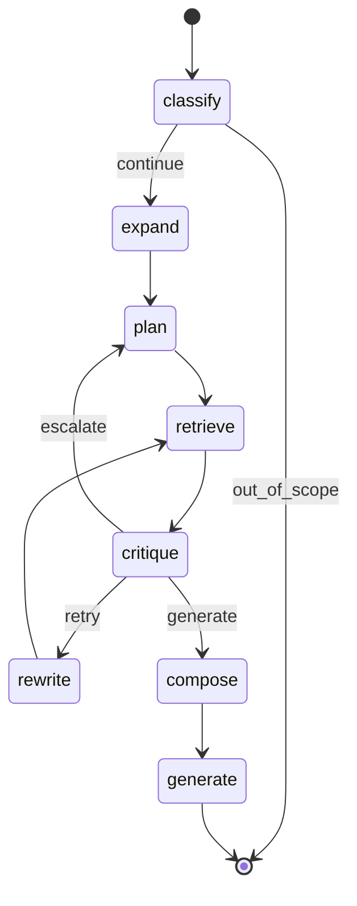
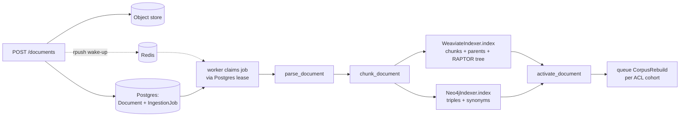

# RAG Application: Ingestion → Chat — Learning Lab

## Learning goal and assumptions

By the end you can, closed-book, trace a document from upload to searchable index, and a
chat query from HTTP request to cited answer — naming the actual function and file:line at
each step, not a generic "chunk, embed, retrieve, generate" sketch.

Assumptions about you: you already know async Python, FastAPI, and generic RAG vocabulary
(chunking, embeddings, reranking). The gap this lab closes is *this repository's* specific
wiring — `backend/app/` only. Frontend is out of scope by request; `evaluation/` and
`scripts/` appear only where they explain ingestion/index-versioning behavior.

All code references are `file:line` against the current tree (root:
`backend/app/`). Line numbers were read directly from the source during this lab's
construction — if the file has since changed, trust the file over this document.

## Why this matters

Two independent async processes — the **api** (`backend/app/main.py`) and the **worker**
(`backend/app/worker.py`) — both import from the same `backend/app/` package and build the
*same* retriever stack independently (`main.py:66-88` vs `worker.py:270-290`, the same
decorator chain; `main.py` gets the classes via the `hybrid_retriever` re-export shim — see
*Where the code diverges from CLAUDE.md*). If you only ever read one entrypoint, half the system is
invisible: the api accepts uploads and streams chat events, but the worker is what actually
parses documents, writes to Weaviate/Neo4j, and runs the LangGraph agent. A bug can live in
either process while only manifesting in the other's behavior.

## Background

- **Postgres** is the single canonical store (documents, jobs, chat runs, citations, leases).
- **Weaviate** (hybrid vector+keyword search) and **Neo4j** (entity/statement graph) are
  *rebuildable* indexes — everything in them can be regenerated from Postgres + the object
  store. This is why `scripts/backfill_index_version.py` and
  `scripts/enqueue_shadow_reindex.py` exist: you can stand up a `v2` index alongside `v1`
  without touching the source of truth.
- **Redis** is wake-up/event transport only — an `rpush` to nudge a polling worker
  (`worker.py:296-299`, `api/routes.py:204-208`) and a pub/sub-style event log for SSE
  streaming (`services/events.py`). Losing Redis delays progress events; it does not lose
  data, because Postgres holds the durable job/run leases.
- Two algorithms recur throughout and are worth knowing by name up front:
  - **RAPTOR** ("Recursive Abstractive Processing for Tree-Organized Retrieval", Sarthi et
    al. 2024, arXiv:2401.18059) — bottom-up clustering + summarization to build a navigable
    tree over chunks, used in `services/raptor.py`.
  - **Personalized PageRank** (Page et al., 1998, "The PageRank Citation Ranking") — used in
    `components/retrieval.py:475-519` to rank graph traversal results by relevance to seed
    terms/entities rather than raw graph connectivity.

## Intuition first

**Ingestion** is a filing system. A document becomes *child chunks* (index cards, ~200
words) grouped under *parent chunks* (folders, ~1,000 words) — `services/ingestion.py:160-189`.
Then RAPTOR repeatedly clusters and summarizes those folders into a table of contents: a
tree where the root node is "what is this whole document about," and each level down gets
more specific until you reach the index cards themselves.

**Chat** is a research assistant with a skeptical editor. The assistant (1) figures out what
*kind* of question you asked, (2) breaks it into sub-questions if needed, (3) sends interns
to fetch quotes from the filing system, (4) an editor grades every quote and throws out
weak ones, and (5) refuses to publish anything not backed by an accepted quote.

## Where the analogy breaks

- The "editor" isn't always a second LLM call — it's a cheap keyword-overlap reranker
  (`components/reranker.py:6-12`) by default, and only upgrades to an LLM critic
  (`prompt("evidence-critic:v1")`, `rag_pipeline.py:287-308`) for `COMPARISON` / `TEMPORAL` /
  `MULTIHOP` routes, and only while under the model-call budget.
- There isn't one filing cabinet — there are two trees with different scopes. `build_raptor`
  (`raptor.py:44`) builds one tree *per document* during ingestion. `rebuild_corpus`
  (`ingestion.py:303`) later builds a *second*, corpus-wide tree over every document's tree
  roots, grouped by exact ACL cohort (`acl_cohort`, `ingestion.py:575-577` — a SHA-256 of the
  sorted ACL group set). The corpus tree is what `Route.SYNTHESIS` queries navigate
  (`retrieval.py:131-144`); it is rebuilt asynchronously after every ingest/delete via a
  queued `CorpusRebuild` task (`worker.py:83-85`, `122-124`), so it can be briefly stale
  relative to the per-document tree.
- The "research assistant" is a fixed graph, not a free-roaming agent — LangGraph enforces a
  specific node order and only two loop-back edges exist (`rag_pipeline.py:54-78`). There's
  no arbitrary tool-calling loop.

## Formal model

### Ingestion-side types (`services/ingestion.py`)

```text
TextBlock(page, text, bbox, heading)        # one paragraph/line-run from the parser
ParsedDocument(blocks, page_count,
               pages_without_text, artifacts)
Chunk(index, text, parent_text, page,
      section, bbox)                        # text = child (~200w), parent_text = folder (~1000w)
```

`SummaryNode` (`services/raptor.py:31-41`) adds `level`, `child_ids`, `source_ids`,
`is_root` — the tree structure over chunks.

### Chat-side types (`schemas/domain.py`)

```text
Route = direct | synthesis | comparison | temporal_causal | multi_hop | out_of_scope
Evidence(id, document_id, text, score, acl_groups,
         source_kind: source|summary|triple|hyde|reasoning,
         context_text)
AgentState  # TypedDict — the full LangGraph state, ~25 fields (domain.py:182-211)
```

`source_kind` is the field that enforces one of the strongest invariants in this codebase:
only `"source"` evidence can reach the user (see Microworld 2).

### The state graph (`services/rag_pipeline.py:53-78`)



Every edge above is a literal `graph.add_edge` / `graph.add_conditional_edges` call at
`rag_pipeline.py:63-77`. The `thread_id` passed into `graph.ainvoke` (`rag_pipeline.py:80-100`)
is always `str(run.id)` — the chat run's own Postgres ID doubles as the LangGraph checkpoint
ID, so a run's full state history is queryable later from the same `AsyncPostgresSaver`
instance used at startup (`main.py:50-52`, `worker.py:238-240`).

## Worked example

### A: One PDF, start to finish



Dashed arrows are best-effort (Redis); solid arrows are the correctness path.

1. `POST /api/v1/documents` (multipart) → `api/routes.py:39`. Content is hashed
   (`content_hash = sha256(content)`, `routes.py:59`); if a document with that hash already
   exists for the tenant, the upload is deduplicated and the existing job is returned
   (`routes.py:66-69`) — no re-ingestion.
2. Bytes go to object storage (`routes.py:74-79`), a `Document` (status `PENDING`) and
   `IngestionJob` are written to Postgres (`routes.py:112-124`), and the job ID is pushed to
   `ingestion:jobs` in Redis (`routes.py:127-128`) purely to wake a polling worker faster.
3. The worker's main loop (`worker.py:295-312`) blocks on that Redis list, then calls
   `store.claim_ingestion_job` — a leased claim in Postgres, not Redis — and runs
   `process_job` (`worker.py:42`).
4. `parse_document(path)` (`worker.py:90`, dispatches at `ingestion.py:56`) picks a parser by
   extension: `parse_pdf` for PDF (PyMuPDF, native text only — `ingestion.py:580-608`),
   `parse_ooxml` for DOCX/PPTX (raw ZIP/XML walk — `ingestion.py:82-157`). A PDF with zero
   extractable text (scanned/image-only) raises `AppError(422, "OCR_REQUIRED", ...)` at
   `ingestion.py:602-607` — the job fails cleanly rather than indexing empty content. This
   exactly matches the CLAUDE.md invariant: *"an image-only PDF must fail with OCR_REQUIRED
   rather than index empty."*
5. A layout manifest (headings, tables, figures, `pages_without_text`) is serialized and
   written beside the source object as `<object_key>.layout.json` (`worker.py:91-106`).
6. `chunk_document(parsed)` (`worker.py:107`, logic at `ingestion.py:160-189`) walks blocks,
   accumulates words under the current heading as `section`, and slices them into
   1,000-word parents, each split into 200-word children.
7. `indexer.index(document, path, chunks=chunks)` (`worker.py:110`, `WeaviateIndexer.index`
   at `ingestion.py:211-268`):
   - `build_raptor(chunks, models, embedder)` (`ingestion.py:218-220`) builds the
     per-document summary tree (see Microworld 1).
   - Chunks, deduplicated parent texts, and every summary level are embedded and posted as
     one Weaviate batch (`ingestion.py:222-254`); each object's `id` is a
     `uuid5(NAMESPACE_URL, f"{index_version}:{document.id}:{document.version}:{key}")` —
     deterministic, so re-running ingestion for the same document/version overwrites rather
     than duplicates.
   - Every object also carries `aclGroups` (`sorted(document.acl_groups) or ["__public__"]`)
     and `indexVersion` — the two fields every retrieval query filters on
     (`ingestion.py:526,537`).
8. `graph_indexer.index(document, chunks)` (`worker.py:114`, `Neo4jIndexer.index` at
   `graph_index.py:63-67`) extracts open `(subject, predicate, object)` triples per *parent*
   chunk via an LLM call (`prompt("open-triples:v1")`, `graph_index.py:109-116`), rejects any
   triple whose subject/object has no lexical overlap with its own source chunk
   (`is_grounded` check, `graph_index.py:126-136` — a prompt-injection defense: an extraction
   the LLM invented rather than read never reaches the graph), then MERGEs `Entity` and
   `Statement` nodes and computes cross-document synonym edges by embedding cosine similarity
   ≥ 0.92 (`graph_index.py:213-255`).
9. `store.activate_document(document)` (`worker.py:116`) flips `index_status` to `ACTIVE`; if
   this was a revision, the previous version's Weaviate/Neo4j entries are deleted
   (`worker.py:117-119`).
10. A `CorpusRebuild` task is queued (`worker.py:122-124`) — asynchronously rebuilds the
    corpus-wide summary tree for this document's exact ACL cohort
    (`process_corpus_rebuild`, `worker.py:142-158` → `WeaviateIndexer.rebuild_corpus`,
    `ingestion.py:303-340`).

**The deletion variant:** `DELETE /documents/{id}` (`routes.py:149-155`) marks the document
`deleting` and queues a job with `operation="delete"`. The worker's delete branch
(`worker.py:69-89`) removes Weaviate and Neo4j entries, then deletes the source object *and*
its `.layout.json` together (`worker.py:74-76` — the CLAUDE.md invariant that manifests
never outlive their source), calls `finalize_document_delete` (sets `deleted_at`,
`postgres.py:266-270`), and queues a corpus rebuild so the dead document's roots leave the
summary tree. Until that rebuild lands, `ActiveDocumentRetriever` is what keeps the deleted
document out of answers.

### B: One chat query, including an escalation

Say a user asks a `DIRECT`-looking question that turns out to need multi-hop reasoning.

1. `POST /api/v1/chat/sessions/{id}/messages` (`api/routes.py:174`) creates a `ChatRun` in
   Postgres and (production path) `rpush`es `chat:runs` in Redis (`routes.py:204-208`) —
   again, just a wake-up hint; the `MemoryStore` test path instead runs the agent inline
   (`routes.py:192-203`) since there's deliberately no external worker in tests.
2. Worker's `process_run` (`worker.py:161`) calls `agent.run(run.query, auth, str(run.id))`.
3. **`classify`** (`rag_pipeline.py:102-137`): the keyword router (`agents/adaptive_router.py:4-16`)
   scans for trigger phrases (`"compare"`→COMPARISON, `"cause"/"timeline"`→TEMPORAL,
   `"connection between"`→MULTIHOP, `"summarize"`→SYNTHESIS, `"ignore previous"`→OUT_OF_SCOPE,
   else DIRECT). Then — unconditionally, whenever `self.models` is set — an LLM call
   (`prompt("router-expansion:v1")`) can override that route (`rag_pipeline.py:111-120`).
   This always-on override is a deliberate CLAUDE.md-documented choice: the keyword router's
   fallback for anything unrecognized is `DIRECT`, which is exactly the case most likely to
   be wrong for realistic phrasing.
4. **`expand`** (`rag_pipeline.py:142-169`): for non-DIRECT routes, an LLM produces an
   `expanded_query` plus `expansion_terms` used only to *retrieve* evidence, never returned
   to the user (see Microworld 2 for where that boundary is enforced).
5. **`plan`** (`rag_pipeline.py:171-226`): `decompose(query, route)`
   (`agents/query_decomposer.py:6-10`) splits COMPARISON queries on `versus|vs|and` into
   multiple leaves; every other route gets one leaf. For COMPARISON/TEMPORAL/MULTIHOP, an
   LLM can replace this with a richer `ReasoningPlan`.
6. **`retrieve`** (`rag_pipeline.py:228-266`): each leaf's query is dispatched in parallel to
   the retriever stack, gated by `settings.max_total_retrieval_calls` (30 by default,
   `core/config.py:37`); leaves beyond the remaining budget are marked `"exhausted"`.
7. **`critique`** (`rag_pipeline.py:268-356`): candidates are filtered through
   `authorized_evidence` (tenant + ACL gate, `security/content_filter.py:4-12`), then graded
   — cheap lexical reranker by default, LLM critic for COMPARISON/TEMPORAL/MULTIHOP. **Here's
   the escalation**: if route is DIRECT and the best accepted score is below
   `settings.direct_confidence_threshold` (0.55), the state is rerouted to `MULTIHOP` with
   `needs_escalation=True` and all leaf state is discarded (`rag_pipeline.py:336-348`).
8. `_after_critique` (`rag_pipeline.py:358-365`) reads `needs_escalation` and routes back to
   `plan` — the graph literally loops `critique → plan → retrieve → critique` for the
   escalated MULTIHOP attempt, this time with real decomposition and an LLM critic.
9. Once no leaf is retryable, **`compose`** (`rag_pipeline.py:397-413`) flattens accepted
   evidence and groups it by source document; **`generate`** (`rag_pipeline.py:415-537`)
   builds one prompt per source group, calls the LLM with `use_pro=True` only for
   `MULTIHOP`/`TEMPORAL` routes (`rag_pipeline.py:463`), and rejects (falls back to a raw
   quote dump) any claim whose `evidence_ids` reference IDs outside the accepted set
   (`rag_pipeline.py:484-487` — a second, independent grounding check after the critique
   step already ran).
10. `process_run` (`worker.py:161-229`) persists citations, streams the answer token-by-token
    over the Redis event broker for SSE (`worker.py:206-220`), and marks the run `complete`
    in Postgres — the durable record — regardless of whether anyone is still listening on the
    SSE stream.

## Microworld 1: RAPTOR clustering (canonical mechanism, ingestion)

**Question:** how does a flat list of child chunks become a navigable tree of summaries?

**Pieces:** chunk embeddings (toy 2D vectors here; real code uses full Voyage embeddings),
`cluster_size` (target group size), `level` (tree depth).

**Rules** (simplified from `_gmm_clusters`, `raptor.py:133-162`, and `build_summary_tree`,
`raptor.py:63-125`):

1. If the current level has ≤ `cluster_size` items, it's one cluster — done, this is the root.
2. Otherwise, split into ≥ 2 groups by embedding proximity (real code: a Gaussian Mixture
   Model whose component count is chosen by BIC — the model picks its own group *count*, not
   just group boundaries).
3. Each group is summarized by an LLM (capped at 4,000 characters,
   `MAX_SUMMARY_CHARACTERS`, `raptor.py:24,87`) into one new node for the next level up.
4. Recurse on the new level's nodes. If a level produces exactly one summary, stop —
   that's the root (`raptor.py:118-119`).

**Controls:** `cluster_size`, the toy embeddings below.

**Predict:** Six chunks about three topics (two chunks each, close together in 2D space),
`cluster_size=2`. Before running: how many tree levels will this produce, and how many nodes
total (including the 6 leaves)? Will the three resulting topic-clusters ever merge into a
single root the way `build_summary_tree` always eventually produces one?

**Run** — dependency-free toy (no sklearn; groups by a similarity threshold instead of a
real GMM, which is the one deliberate simplification here — see Explain below for why that
matters):

```python
import math

CHUNKS = {
    "c0": (0.0, 0.0), "c1": (0.1, 0.0),   # topic A
    "c2": (5.0, 0.0), "c3": (5.1, 0.1),   # topic B
    "c4": (2.5, 5.0), "c5": (2.6, 5.1),   # topic C
}

def dist(a, b):
    return math.dist(a, b)

def cluster_round(nodes: dict[str, tuple], threshold: float, target: int):
    """ponytail: nearest-neighbor grouping, not real GMM+BIC — see Explain below."""
    remaining = dict(nodes)
    clusters = []
    while remaining:
        seed_id, seed_pt = next(iter(remaining.items()))
        group = {seed_id: remaining.pop(seed_id)}
        for other_id, pt in list(remaining.items()):
            if len(group) < target and dist(seed_pt, pt) <= threshold:
                group[other_id] = remaining.pop(other_id)
        clusters.append(group)
    return clusters

def centroid(group: dict[str, tuple]) -> tuple:
    xs, ys = zip(*group.values())
    return (sum(xs) / len(xs), sum(ys) / len(ys))

def build_tree(nodes: dict[str, tuple], threshold=1.0, target=2, max_rounds=10):
    level, all_levels = nodes, [nodes]
    for _ in range(max_rounds):
        if len(level) <= target:
            break
        next_level = {
            f"L{len(all_levels)}-{i}": centroid(g)
            for i, g in enumerate(cluster_round(level, threshold, target))
        }
        if len(next_level) >= len(level):
            break  # fixed threshold can't split further -- unlike real BIC-selected GMM
        level, all_levels = next_level, all_levels + [next_level]
    return all_levels

for depth, lvl in enumerate(build_tree(CHUNKS)):
    print(f"level {depth}: {sorted(lvl)}")
```

**Observe:** it prints two levels — `level 0` with all 6 raw chunk IDs, `level 1` with 3
topic-centroid IDs — and then stops. It does **not** reach a single root.

**Explain:** each level is one pass of `build_summary_tree`'s `while current:` loop
(`raptor.py:74`); the toy's `threshold` stands in for GMM cluster assignment, `target` for
`cluster_size`. But watch what the toy's guard (`if len(next_level) >= len(level): break`)
had to do: after round 1, the three topic centroids are ~5 units apart — further than
`threshold=1.0` — so `cluster_round` can't merge any of them and would return 3 singleton
"clusters" forever without that guard. The real `_gmm_clusters` (`raptor.py:133-162`) never
hits this failure mode, because it doesn't group by a fixed distance at all: whenever
`len(items) > target_cluster_size`, it always fits GMMs with 2..`max_components` and keeps
the BIC-best one — guaranteeing a real split every round regardless of how far apart the
points are — until the level finally collapses to `<= target_cluster_size` and returns one
cluster (`raptor.py:137-138`), which `build_summary_tree` then marks as the root
(`raptor.py:118-119,122-124`). The toy's distance threshold is the one place this
simplification diverges from the real algorithm — and it's exactly what stops the toy from
reaching the single-root guarantee the real code has. The real code additionally computes an
`is_grounded` check on every summary (`raptor.py:94-99`) — a summary sharing no vocabulary
with its source cluster is treated as more likely hallucinated/injected than faithful, and
falls back to an extractive excerpt instead.

**Perturb:** set `target=6` (i.e., `cluster_size=6`, ≥ all 6 chunks) and predict the output
before running — does it match the real code's floor case at `raptor.py:137-138`
(`if len(items) <= target_cluster_size: return [items]`)? What happens to `is_root` in the
real code when there's only one node at level 1 (`raptor.py:118-119,122-124`)?

## Microworld 2: paraphrase retrieval + the ACL/refusal boundary (edge case, chat)

**Question:** a user asks about "the merger" but no `Statement` node's text contains that
exact word — only "acquisition." How does the graph retriever find it, and what happens if
the one relevant statement turns out to be ACL-restricted?

**Pieces:** toy `Statement`↔`Entity` graph, lexical `terms` vs. embedding-seeded `seed_keys`,
damping factor, an ACL group.

**Rules:**

- `_traverse` (`retrieval.py:428-440`) first tries lexical seeding: does any term in the
  query substring-match a statement's text or its subject/object entity key? If the query
  paraphrases (zero term overlap), this returns nothing.
- `_embedding_seed_keys` (`retrieval.py:442-458`) is the fallback: embed the query, rank all
  candidate entities in-tenant by cosine similarity to their (pre-computed,
  `graph_index.py:257-274`) embeddings, and re-run traversal seeded by the top matches
  instead of lexical terms.
- `_personalized_pagerank` (`retrieval.py:475-519`) then ranks every returned statement by
  how much "seed weight" flows to it through the bipartite Statement↔Entity graph — lexical
  matches contribute `lexical_score`, embedding-seeded entities get a flat seed weight of
  `1.0` (`retrieval.py:500-503`).
- Independently of ranking, `_TRAVERSAL_CYPHER` (`retrieval.py:315-360`) already filtered
  candidate statements to `tenant_id` match and `acl_groups` empty **or** overlapping the
  caller's groups — *before* any ranking happens. But a second, final gate exists
  downstream: `authorized_evidence` (`security/content_filter.py:4-12`) re-checks ACL on
  whatever the retriever returned, and additionally drops anything whose `source_kind !=
  "source"` — the enforcement point for "synthetic expansion/summary text can retrieve, but
  never itself become, returned evidence."

**Controls:** damping, iteration count, which entities are seeded.

**Predict:** In the toy graph below, `"acquisition"` and `"merger"` are given a high
similarity edge (as if their real embeddings were close), landing `"acquisition"` in the
seed set. Two statements exist: one connects to `"acquisition"`, the other is disconnected.
Which one ranks higher, and why does that match `_personalized_pagerank`'s design rather
than being circular?

**Run** — dependency-free, mirrors the real algorithm almost line-for-line:

```python
def personalized_pagerank(adjacency: dict[str, set[str]], seeds: dict[str, float],
                           damping=0.85, iterations=20):
    total = sum(seeds.values())
    personalization = {n: s / total for n, s in seeds.items()}
    scores = {n: personalization.get(n, 0.0) for n in adjacency}
    for _ in range(iterations):
        updated = {n: (1 - damping) * personalization.get(n, 0.0) for n in adjacency}
        for node, neighbors in adjacency.items():
            if not neighbors:
                continue
            contribution = damping * scores[node] / len(neighbors)
            for neighbor in neighbors:
                updated[neighbor] += contribution
        scores = updated
    return dict(sorted(scores.items(), key=lambda kv: kv[1], reverse=True))

adjacency = {
    "s:deal_announced": {"e:acquisition", "e:acme_corp"},
    "e:acquisition": {"s:deal_announced"},
    "e:acme_corp": {"s:deal_announced"},
    "s:unrelated_fact": {"e:weather", "e:portland"},
    "e:weather": {"s:unrelated_fact"},
    "e:portland": {"s:unrelated_fact"},
}
# "merger" paraphrases "acquisition" -- embedding-seeded, not lexical.
seeds = {"e:acquisition": 1.0}

for node, score in personalized_pagerank(adjacency, seeds).items():
    if node.startswith("s:"):
        print(f"{node}: {score:.4f}")
```

**Observe:** `s:deal_announced` ranks far above `s:unrelated_fact` despite the query
containing neither node's literal text.

**Explain:** the seed weight on `e:acquisition` (standing in for the query's embedding
neighbor) propagates one hop to `s:deal_announced` every iteration; `s:unrelated_fact` has no
path from any seed, so it converges to its damping floor only. This is exactly why
`Neo4jRetriever` persists entity embeddings at ingestion time (`graph_index.py:257-274`) —
without them, `_embedding_seed_keys` would have nothing to rank against, and a pure-paraphrase
query would return zero graph evidence.

**Perturb — the ACL counterexample:** now suppose `s:deal_announced`'s source document has
`acl_groups = {"finance-only"}` and the caller's groups don't include it. In the real system:

1. `_TRAVERSAL_CYPHER`'s `WHERE` clause never returns the row in the first place
   (`retrieval.py:320-322`) — it's excluded before ranking, not after.
2. If some *other* bug let it through anyway, `authorized_evidence` would still drop it at
   critique time (`content_filter.py:11`).
3. If that was the *only* accepted evidence for every leaf, `accepted_evidence` ends up empty,
   and `_generate` (`rag_pipeline.py:416-419`) returns the fixed string *"I could not find
   enough authorized evidence to answer reliably"* — it does not fall back to answering from
   general knowledge. Predict, then check `rag_pipeline.py:415-426`: what does the function
   return for `citations` in that case, and why does that matter for the UI?

## Design rationale: why each component, and its trade-offs

Knowing *what* each piece does is half the job; knowing *why it's there instead of the
obvious alternative* is what lets you change one without breaking the reason it exists.

### Parent/child chunking ("small-to-big")

- **Why:** small chunks (~200 words) embed precisely — one topic per vector — but are too
  thin to generate from. So retrieval matches on the child, generation reads the parent
  (`Evidence.context_text` is set to `parentText`, `retrieval.py:229`; `_generate` prefers
  `context_text` over `text`, `rag_pipeline.py:442`).
- **Pros:** better recall than embedding 1,000-word blocks; better generation context than
  200-word fragments. **Cons:** parents are stored and embedded too (~2× objects), and
  parent dedup (`ingestion.py:221`) is needed because siblings share a parent.
- **Rejected alternative:** one chunk size for both jobs — forces a bad compromise on either
  match precision or generation context.

### RAPTOR summary trees

- **Why:** "summarize the trends across all filings" has no good top-k answer — the
  information lives in no single chunk. RAPTOR pre-pays at ingestion: cluster chunks,
  summarize clusters, recurse, so a `SYNTHESIS` query can *navigate* (root → children →
  `sourceKeys`) instead of hoping k chunks happen to span the corpus
  (`_summary_sources`, `retrieval.py:234-277`).
- **Pros:** corpus-level questions become tractable; navigation is cheap at query time (no
  LLM calls); summaries are bounded (4,000 chars) so the tree can't blow up context.
- **Cons:** ingestion cost scales with corpus size (one LLM call per cluster per level); the
  *corpus* tree is eventually-consistent (rebuilt asynchronously per ACL cohort, one rebuild
  per cohort per burst, and only when ingestion is quiescent — `postgres.py:191-212`); and
  summaries are LLM output over untrusted documents, which is exactly why they're
  navigation-only (`source_kind` gate) and `is_grounded`-checked (`raptor.py:94-99`).
- **Rejected alternative:** query-time map-reduce summarization — correct but pays the full
  LLM cost on *every* synthesis query instead of once per ingest.

### The Neo4j triple graph + personalized PageRank (HippoRAG-style)

- **Why:** multi-hop questions ("how is X connected to Y?") need *entity bridging*: the
  connecting fact often shares no vocabulary with the query, so vector similarity ranks it
  low. Extracting `(subject, predicate, object)` statements at ingestion and ranking them
  with personalized PageRank over the Statement↔Entity graph (`retrieval.py:475-519`) finds
  paths instead of lookalikes — the same insight as HippoRAG (see Sources).
- **Pros:** cross-document hops vector search can't make; every graph result carries
  provenance (`source_text`, page, document) so it's citable; query-time cost is a Cypher
  query + in-process PageRank, no LLM.
- **Cons:** extraction is the weak link — it's an LLM call per parent chunk (cost), it can
  hallucinate (mitigated by the `is_grounded` rejection, `graph_index.py:126-136`), and
  what was never extracted can never be found. Synonym edges (cosine ≥ 0.92,
  `graph_index.py:231`) and embedding-seeded traversal (`retrieval.py:442-458`) patch the
  two biggest gaps (surface-form mismatch, paraphrase queries), each adding its own knobs.
- **Rejected alternative:** iterative LLM-driven retrieval (retrieve → reason → retrieve
  again) — more flexible, but N sequential LLM calls per query versus HippoRAG's zero.
- **This is also why `CompositeRetriever` is route-gated:** the graph only earns its keep on
  `MULTIHOP`/`TEMPORAL`; for everything else it's latency for nothing
  (`retrieval.py:530-536`).

### Adaptive routing (keyword router + LLM override)

- **Why:** most questions are cheap `DIRECT` lookups; a few need decomposition, graph
  retrieval, or Pro-model synthesis. Classifying first means paying for machinery only when
  the question needs it.
- **Pros:** cost/latency scale with question difficulty, not worst case.
- **Cons:** misrouting is a real failure mode with a real history here — the keyword
  router's fallback is `DIRECT`, which was wrong often enough (16.7% route accuracy on
  realistic phrasing) that the LLM override became unconditional, buying ~82% accuracy at
  the price of `direct_p95_ms` going from 2,000 to 3,500 (documented in CLAUDE.md and
  `evaluation/thresholds.json`). That trade is the single clearest example in this codebase
  of accuracy-vs-latency being an *explicit, measured* decision — don't undo either side of
  it casually.

### Planner (decompose-then-retrieve) instead of a free agent loop

- **Why:** a fixed LangGraph (`plan → retrieve → critique`, with only two loop-back edges)
  makes cost bounded and behavior checkpointable — every leaf retrieves in *parallel*
  (`asyncio.gather`, `rag_pipeline.py:249-256`), and the whole state is durable in Postgres
  per run.
- **Pros:** predictable worst case (`max_total_model_calls` / `max_total_retrieval_calls` /
  `max_leaf_retries` are hard budgets); resumable/debuggable via checkpoints; parallelism a
  sequential ReAct loop can't have.
- **Cons:** less adaptive than a free tool-calling agent — the plan can't restructure
  mid-flight except through the two sanctioned paths (rewrite a failed leaf, or escalate
  DIRECT→MULTIHOP and re-plan). If a question needs a genuinely novel strategy, this graph
  won't invent one.

### Critic/grader as a separate validation step (corrective-RAG pattern)

- **Why:** retrieval quality is the dominant failure mode in RAG. Grading evidence *before*
  generation — and looping back (rewrite) or re-planning (escalate) on failure — catches bad
  retrieval where it's still fixable, instead of generating a confident answer from junk.
- **Pros:** the retry loop gives recall a second chance with a rewritten query informed by
  *why* evidence was rejected (`rejection_reasons` feed the rewrite prompt,
  `rag_pipeline.py:380-384`); the DIRECT confidence escalation upgrades the whole strategy
  when cheap retrieval visibly failed.
- **Cons:** each critique/rewrite round is latency and model calls; the cheap default grader
  is deliberately dumb (lexical overlap, `reranker.py:6-12` — its own docstring says a
  model-backed reranker must be *justified by evaluation* first), so on non-hard routes a
  relevant-but-differently-worded candidate can be rejected.

### Grounded claims + citation verification (the validator on the way out)

- **Why:** free-text generation can't be checked. Forcing the model to emit
  `claims[{text, evidence_ids}]` JSON (`GroundedAnswer`, used at `rag_pipeline.py:466-508`)
  makes grounding *verifiable*: every claim must cite accepted, `source`-kind evidence IDs,
  checked in code, not trusted.
- **Pros:** three independent refusal/degradation paths instead of hallucination — empty
  evidence → fixed refusal; empty claims → refusal with "Missing: ..."; out-of-set citation
  → fall back to a raw quote dump rather than publish an unverifiable claim.
- **Cons:** JSON output is brittle (hence the pervasive fallback pattern), and the quote-dump
  fallback is ugly for the user — the system deliberately prefers ugly-but-grounded over
  fluent-but-unverifiable.

### Two-model tiering (Flash default, Pro for hard synthesis)

- **Why:** most calls (routing, expansion, critique, ordinary answers) are
  structured-output classification a small model does fine; only `MULTIHOP`/`TEMPORAL`
  final synthesis gets Pro (`use_pro=...`, `rag_pipeline.py:463`).
- **Pros:** cost tracks difficulty; per-call token/cost accounting is built into the gateway
  (`llm.py:73-86`). **Cons:** two models to evaluate and version; the `use_pro` route set is
  one more place route semantics are duplicated.

### Exact-key "semantic" cache — naming honesty

`SemanticCache` (`semantic_cache.py`) is, today, an *exact-key* cache: `CachedRetriever`
hashes the normalized query + auth + route + version — no embedding similarity is involved.
Two paraphrases of the same question miss each other. The name marks the intended upgrade
path, not the current behavior. Pros: zero false-positive cache hits (a similarity cache can
return a subtly-wrong cached answer); cons: hit rate is low for free-form chat. Know this
before you "fix" a low cache-hit metric.

### Postgres canonical + rebuildable indexes

- **Why:** one source of truth means index corruption, schema migration, or a bad reindex is
  never data loss — `enqueue_shadow_reindex.py` + a `v2` worker rebuilds everything from
  Postgres + object storage while `v1` keeps serving.
- **Pros:** fearless index evolution; `ActiveDocumentRetriever` makes index staleness
  harmless rather than needing synchronous dual-writes. **Cons:** eventual consistency
  everywhere (a document is searchable only after its job completes; the corpus tree lags
  further), and every new index feature must stay rebuildable-from-Postgres or the whole
  property breaks.

## From understanding to working on it

The two flows above are the *what*; this section is the *how do I safely touch it* — the
parts a new dev hits in their first week that neither flow walkthrough covers.

### How a request gets authorized at all

Every route depends on `auth_context` (`security/auth.py:12-55`). Two modes, switched by
`settings.dev_auth`:

- **Dev** (`DEV_AUTH=true` locally): identity comes from headers — `X-Tenant-ID` and
  `X-User-ID` are required (401 otherwise), `X-Groups` is a comma-separated ACL list
  (`auth.py:20-27`). This is why every curl against the local API needs those headers.
- **Deployed**: a `Bearer` JWT validated against the OIDC JWKS (fetched once and cached on
  `app.state.jwks`, `auth.py:36-46`); `tenant_id` and `groups` come from token claims.

Either way, the result is the same `AuthContext(subject, tenant_id, groups)` that flows
through retrieval filters and `authorized_evidence`. A per-tenant/per-user rate limit rides
on the same dependency (`enforce_rate_limit`, `auth.py:58-71`) — Redis-counter based, and
**fail-open**: if Redis is down, requests are not rate limited (`auth.py:60-61,68-69`),
consistent with "Redis is never load-bearing for correctness."

### The lease mechanics behind "Postgres is the durable queue"

The doc says "leases" throughout; here is the actual machine
(`repositories/postgres.py:153-171`, `claim_ingestion_job` — `claim_chat_run` at
`postgres.py:343` is the same shape):

```sql
WITH candidate AS (
  SELECT id FROM ingestion_jobs
  WHERE attempts < 3 AND index_version=$3 AND (
    status='queued' OR (status='running' AND lease_until < now())
  )
  ORDER BY created_at FOR UPDATE SKIP LOCKED LIMIT 1
)
UPDATE ingestion_jobs j SET status='running', attempts=j.attempts+1,
  worker_id=$1, lease_until=now()+($2 * interval '1 second')
FROM candidate WHERE j.id=candidate.id RETURNING j.*
```

Four properties fall out of this one statement, and they explain most worker behavior:

1. **Crash recovery is automatic** — a job whose worker died stays `running` until
   `lease_until` (15 min, `worker.py:301`) passes, then any worker can reclaim it.
2. **`attempts < 3` is the poison-pill guard** — a job that keeps crashing its worker is
   abandoned after 3 claims, matching the retry logic in `process_job`
   (`worker.py:130-134`).
3. **`FOR UPDATE SKIP LOCKED`** is what lets N workers poll concurrently without ever
   double-claiming — no Redis lock, no coordinator.
4. **`index_version=$3`** is the entire shadow-reindex isolation mechanism: a `v2` worker
   only claims `v2` jobs, so running `scripts/enqueue_shadow_reindex.py --version v2`
   (which INSERTs `v2` jobs for every active document) plus one worker deployed with
   `INDEX_VERSION=v2` reindexes the corpus without the `v1` API or workers noticing.

One more subtlety worth knowing before you touch corpus rebuilds:
`claim_corpus_rebuild` (`postgres.py:191-212`) refuses to claim anything while *any*
ingestion job for that index version is queued or running (`NOT EXISTS` subquery) — corpus
trees are only rebuilt over a quiescent corpus. And `request_corpus_rebuild`
(`postgres.py:173-189`) upserts on `(tenant_id, acl_cohort, index_version)`, so a burst of
ingests coalesces into one rebuild per cohort instead of a queue of redundant ones.

### The retriever chain, one responsibility per layer

Reading order = execution order (built at `main.py:68-88` / `worker.py:270-290`):

| Layer | File:lines | Single job |
|---|---|---|
| `ActiveDocumentRetriever` | `retrieval.py:66-94` | Final gate against the canonical store: drop evidence whose document is deleted/superseded/ACL-revoked in Postgres (`active_document_ids`, `postgres.py:240-253`); re-fetch wider once if that filtering starved the result set |
| `CachedRetriever` | `retrieval.py:34-63` | Exact-key result cache; the key hashes `[index_version, tenant, groups, route, query, limit]` — so a cache hit can never leak across tenants, ACL sets, or index versions |
| `RerankingRetriever` | `retrieval.py:539-549` | Rerank candidates via the Voyage reranker, cap at `max_reranked_candidates` (20) |
| `CompositeRetriever` | `retrieval.py:522-536` | Fan out to graph+vector for `MULTIHOP`/`TEMPORAL` (half the limit each), vector-only otherwise |
| `WeaviateRetriever` / `Neo4jRetriever` | `retrieval.py:107-312` / `377-458` | The actual datastore queries, each with tenant+ACL+indexVersion in every filter |

Note the ordering consequence: the cache sits *outside* reranking, so cached entries are
already reranked; and `ActiveDocumentRetriever` sits outside the cache, so even a cached
result gets re-checked against Postgres — a document deleted 10 seconds ago disappears from
answers immediately, without waiting out the 300s cache TTL
(`semantic_cache.py:8`).

### Prompts are a dict, not a system

`prompts/registry.py:14-29` — ten string templates keyed `"name:v1"`, looked up by
`prompt(name)`. Changing model behavior = editing a template in `prompts/templates.py` and,
if the output schema changes, the matching Pydantic model in `schemas/agent.py`. Version
bumps are by convention (add a `:v2` key), not enforced by tooling.

### Day-one commands

From the project CLAUDE.md (kept there as source of truth — these are the ones you'll
actually use):

```bash
uv sync --extra dev                                       # install
uv run uvicorn app.main:app --app-dir backend --reload    # api only
docker compose up --build                                 # full stack (api, frontend, pg:5433, redis, minio)
uv run --extra dev pytest -q                              # tests
uv run ruff check backend evaluation tests                # lint
```

Weaviate and Neo4j are always external/hosted (`.env`: `WEAVIATE_URL`/`WEAVIATE_API_KEY`,
`NEO4J_URI`/`NEO4J_USER`/`NEO4J_PASSWORD`) — never add local containers for them. Every dev
API call needs the `X-Tenant-ID` / `X-User-ID` (/ `X-Groups`) headers per the auth section
above. Evaluation gates live in `evaluation/thresholds.json` (e.g. `direct_p95_ms: 3500`) and
are checked by `evaluation/runtime_report.py` — if you change routing or add a sequential
LLM call, expect to revisit them.

### Change map: "I want to… → touch…"

| Change | Where | Watch out for |
|---|---|---|
| Support a new file type | `parse_document` dispatch (`ingestion.py:56-67`) + a parser returning `ParsedDocument` | Must fail with a typed `AppError`, never index empty |
| Tune chunk sizes | `chunk_document` defaults (`ingestion.py:160-161`) | Parents are the LLM context unit (`context_text`); Neo4j extracts per parent |
| Add/change a route | `Route` enum (`domain.py:17-23`), keyword router (`adaptive_router.py`), `router-expansion:v1` prompt, then every `route in {...}` set in `rag_pipeline.py` and `CompositeRetriever` | The route sets are duplicated across ~5 call sites — grep `Route.` before claiming done |
| Change grading strictness | `document_grader.py` / `reranker.py` (cheap path), `evidence-critic:v1` prompt (LLM path), `direct_confidence_threshold` (`config.py:39`) | Lowering the threshold reduces escalations but risks weak DIRECT answers |
| Add a Weaviate property | `_schema_properties` (`ingestion.py:466-488`) | Must be rolling-upgrade safe: retrieval already tolerates a missing optional property (see the `parentText` retry at `retrieval.py:194-203`) |
| Add pipeline state | `AgentState` (`domain.py:182-211`) + the node returning it | State is checkpointed to Postgres per run; keep it JSON-serializable |
| Change API surface | `api/routes.py` + `schemas/domain.py` request/response models | Every route must Depends on `auth_context`; scope every store call by `auth.tenant_id` |
| New background work | Add a claim method in `postgres.py` following the lease SQL pattern, poll it in `worker.py`'s loop | Redis push is optional sugar; the Postgres claim is the correctness path |

## Where the code diverges from CLAUDE.md / AGENTS.md

Verified by grepping every import across `backend/app` and `tests` — trust this list only as
of today; re-run the grep before relying on it:

- **`components/hybrid_retriever.py` is a re-export shim.** CLAUDE.md credits it with
  composing the retriever stack, but it contains only `from .retrieval import ...` plus
  `__all__` (`hybrid_retriever.py:1-21`). The real implementation — every class, all ~550
  lines — lives in `components/retrieval.py`. `main.py` imports through the shim,
  `worker.py` imports `retrieval` directly; same classes either way.
- **Three modules CLAUDE.md lists as live architecture are dead code**, imported by nothing
  in the app or tests:
  - `services/conversation.py` (`require_owned_session`) — the session-ownership check is
    inlined at `routes.py:181-183` instead.
  - `services/query_router.py` — the pipeline imports `agents/adaptive_router.classify`
    directly (`rag_pipeline.py:12`); this wrapper is bypassed.
  - `tools/vector_search.py` — CLAUDE.md describes `tools/` as "agent-callable retrieval
    operations," but no graph node calls it; `_retrieve` calls `self.retriever.retrieve`
    directly.
- **`security/output_filter.py` is not in the production path.** CLAUDE.md's request path
  ends in "output verification" and lists `output_filter.py` as one of the security trust
  boundaries, but only `tests/test_layers.py` imports it. The output verification that
  actually runs is inline in `_generate`: the claims-cite-only-accepted-evidence check
  (`rag_pipeline.py:484-487`) and the empty-claims refusal (`rag_pipeline.py:472-483`).
- **`SemanticCache` is exact-key, not semantic** — see *Design rationale*. The CLAUDE.md
  architecture text ("semantic_cache.py") and class name promise similarity matching the
  implementation doesn't do.

None of these are bugs — the behavior CLAUDE.md describes exists; it just lives somewhere
else (inline, or one layer down). But if you're asked to "extend the output filter" or "add
a tool," check this list first: the natural-looking file may be the one nothing runs.

## Common misconceptions

- **"The LLM decides the route."** The keyword router runs first and always
  (`adaptive_router.py:4-16`); the LLM router-expansion call runs unconditionally afterward
  and *can* override it — but if that call fails or returns malformed JSON, the code falls
  back to the keyword result silently (`_log_fallback`, `rag_pipeline.py:121-123`). Nothing
  retries the whole run over a bad structured-output parse.
- **"Neo4j and Weaviate are both queried for every question."** `CompositeRetriever`
  (`retrieval.py:522-536`) only fans out to both for `MULTIHOP`/`TEMPORAL` routes; every
  other route is vector-search only.
- **"RAPTOR summaries can be cited as evidence to the user."** They're navigation-only.
  `Evidence.source_kind` exists precisely so `authorized_evidence` can filter to
  `source_kind == "source"` only (`content_filter.py:11`) — summaries can steer *which*
  chunks get fetched (`WeaviateRetriever._summary_sources`, `retrieval.py:234-277`), never
  appear in a citation.
- **"A failed leaf retries forever."** Capped by `settings.max_leaf_retries` (2, checked in
  `_after_critique`, `rag_pipeline.py:362`) and by the global `max_total_retrieval_calls` /
  `max_total_model_calls` budgets threaded through `_retrieve`/`_plan`/`_critique`/`_rewrite`.
- **"Redis is required for correctness."** It's wake-up transport and a best-effort semantic
  cache only. `SemanticCache.get`/`set` swallow `RedisError` and just skip caching
  (`services/semantic_cache.py:12-23`); the worker still finds queued jobs/runs by polling
  Postgres leases even if the Redis `rpush` never happened (`routes.py:204-208` wraps the
  push in a try/except for exactly this reason).
- **"A malformed LLM JSON response fails the chat run."** It's caught locally, inside the
  node that made the call (`except (ValueError, json.JSONDecodeError, OpenAIError)` appears
  six times in `rag_pipeline.py`), logged once via `_log_fallback`, and the node degrades to
  a non-LLM fallback — the durable run is never retried wholesale over this.
- **"The agent sees the conversation history."** It doesn't. `process_run` calls
  `agent.run(run.query, auth, str(run.id))` (`worker.py:172-176`) — only the current
  question, and the checkpoint `thread_id` is the *run* ID, not the session ID
  (`rag_pipeline.py:92`). Sessions (`ChatSession`) group runs for the UI and ownership
  checks; no prior turn's text or answer reaches the model. A follow-up like "what about
  the second one?" retrieves against those literal words. If you're asked to add multi-turn
  awareness, that's a real feature (fetch prior runs from the session and fold them into the
  query or state), not a config flag.

## Transfer challenge

Without opening any file, write down — file and function name, not just a paragraph — the
full call path for each scenario:

1. A user uploads a second version of an already-ingested document, passing `revision_of`
   set to the original document's ID. Name every place the *previous* version's index
   entries get cleaned up, and what happens to its `logical_id`/`version` fields.
2. A `TEMPORAL`-route chat query comes in. Its single leaf fails grading twice in a row
   (rejected both times by the LLM critic). What does the state look like when the graph
   finally reaches `generate`, and what string does the user see?

Then open the files and check yourself against `worker.py:63,90-125`, `routes.py:100-111`
for (1); `rag_pipeline.py:358-365,415-426` for (2).

## Self-quiz

Answer closed-book. Record a 1–5 confidence per question before checking the key.

1. **(recall)** Which two files build the *identical* retriever decorator chain
   independently, and why does that duplication exist rather than being shared?
2. **(recall)** What HTTP status/error code does an image-only scanned PDF produce, and
   where is it raised?
3. **(prediction)** A `DIRECT`-route query gets one accepted evidence item with score 0.4.
   `direct_confidence_threshold` is 0.55. What does `_critique` return, and which node runs
   next?
4. **(prediction)** In Microworld 1's toy, if `threshold` is set so small that no two chunks
   are ever close enough to merge, what does `build_tree` return, and why does the real
   `_gmm_clusters` never need an equivalent "no progress" guard?
5. **(application)** You need to add a new document type (e.g., `.eml`). Which single
   function's dispatch logic do you extend, and what does the function you write need to
   return to be compatible with `chunk_document`?
6. **(application)** You want a `SYNTHESIS`-route query to search only within one specific
   ACL cohort's corpus tree instead of the caller's actual groups. Which function's `where`
   filter would you need to change, and what real invariant would that violate?
7. **(misconception diagnosis)** A teammate says "since RAPTOR summaries are stored in
   Weaviate with `nodeType: summary`, they must show up as citations sometimes for
   synthesis questions — that's the whole point of summaries." What's wrong with this claim,
   and which two functions together prevent it?
8. **(synthesis)** Trace what happens if Redis is completely down for the entire lifetime of
   one chat run, from `POST .../messages` to the run reaching `status: complete` in Postgres.
   What does the user experience differently, and what stays identical?
9. **(mechanism)** A worker crashes mid-ingestion, 5 minutes into a job. Nothing cleans up
   after it. When and how does that job get processed, which SQL clause makes it possible,
   and what stops a job that *keeps* crashing workers from being retried forever?
10. **(application)** A document is deleted, but the semantic cache still holds a
    5-minute-TTL entry containing its chunks as evidence. Why does the very next query that
    hits that cache entry still not cite the deleted document? Name the layer and its
    position in the chain.

<details><summary>Answer key and scoring</summary>

1. `backend/app/main.py:66-88` (api) and `backend/app/worker.py:270-290` (worker). Both
   processes need their own live retriever instance — there's no shared long-lived process
   to hold one — so each builds it from settings at startup. If you missed this, revisit
   *Why this matters* and the Worked Example A step 3.
2. `AppError(422, "OCR_REQUIRED", ...)`, raised at `ingestion.py:602-607` inside `parse_pdf`,
   when `parse_pdf` finds zero text blocks across every page. Revisit Worked Example A step 4.
3. Score 0.4 < 0.55 threshold and route is DIRECT → `_critique` returns
   `route: MULTIHOP, escalated: True, needs_escalation: True`, discards leaf/evidence state
   (`rag_pipeline.py:340-348`). `_after_critique` sees `needs_escalation` and returns
   `"escalate"`, which the conditional edge maps to `"plan"` (`rag_pipeline.py:70-74`) — so
   `plan` runs next, not `rewrite` or `compose`. If you said "rewrite," you missed that
   `needs_escalation` is checked *before* the retry logic in `_after_critique`
   (`rag_pipeline.py:358-361`).
4. `cluster_round` returns each chunk as its own singleton "cluster," so `next_level` has the
   same count as `level`, the `if len(next_level) >= len(level): break` guard fires
   immediately, and `build_tree` returns after exactly one (unchanged) level — the toy needed
   that guard specifically to avoid looping forever re-producing singleton clusters at a
   threshold nothing can cross. The real `_gmm_clusters` never needs an equivalent guard
   because it doesn't group by a fixed distance at all: whenever `len(items) >
   target_cluster_size`, BIC always selects *some* number of components between 2 and
   `max_components`, guaranteeing every round strictly shrinks the node count regardless of
   how the points are distributed. This is exactly why the Microworld's Explain step flags
   the toy's threshold-based grouping as the one place it diverges from the real algorithm.
5. `parse_document` (`ingestion.py:56`), which dispatches by suffix. Your new parser must
   return a `ParsedDocument(blocks=tuple[TextBlock,...], page_count, pages_without_text,
   artifacts=())` — `chunk_document` only reads `.blocks` (specifically `.heading`, `.text`,
   `.page`, `.bbox` per block), so any parser producing that shape works.
6. `_document_roots`'s GraphQL `where` clause (`ingestion.py:342-377`), specifically the
   `aclCohort` equality filter. Changing it to accept an arbitrary cohort rather than the
   caller's own `acl_cohort(document.acl_groups)` would violate the tenant/ACL invariant in
   CLAUDE.md ("every retrieval filter includes tenant and ACL constraints before scoring") —
   it would let one ACL cohort's corpus rebuild read another cohort's document roots.
7. Wrong because `nodeType: summary` objects in Weaviate are used only for *navigation* —
   `WeaviateRetriever._summary_sources` (`retrieval.py:234-277`) uses them to find which
   `sourceKeys` (chunk IDs) to actually search, and never returns the summary text itself as
   an `Evidence` object from `_search_chunks`. Even if a summary *did* leak through as
   `Evidence` with `source_kind="summary"`, `authorized_evidence`
   (`content_filter.py:8-12`) filters to `source_kind == "source"` before critique — two
   independent layers, not one.
8. The user experience: SSE events (`token`, `status`, `answer`, `complete`) never arrive,
   because both the api→worker wake-up (`routes.py:205`) and the worker's event publishing
   (`worker.py:170,178,206-220`) go through Redis and fail/no-op. But nothing about
   correctness changes: the worker still finds the queued run by polling
   `store.claim_chat_run` against Postgres leases (`worker.py:313`, no Redis dependency),
   runs the full graph, and writes `run.status = "complete"` with the final answer and
   citations to Postgres (`worker.py:210-211`) — a client that just polls
   `GET /chat/runs/{id}` (rather than the SSE endpoint) would see it complete normally, just
   without live tokens. (One nuance: the API's `rpush` failure is explicitly swallowed at
   `routes.py:204-208`; rate limiting also fails open without Redis, `auth.py:68-69`.)
9. The job sits in `status='running'` with a stale lease until `lease_until < now()` —
   15 minutes after claim (`worker.py:301`) — at which point `claim_ingestion_job`'s
   candidate `WHERE` clause (`postgres.py:159-161`) makes it claimable again by any worker;
   `FOR UPDATE SKIP LOCKED` guarantees exactly one claims it. The forever-retry stopper is
   `attempts < 3` in the same clause: each claim increments `attempts`, so a poison job is
   abandoned after its third claim. If you said "the worker cleans up its own lease on
   crash" — nothing does; expiry *is* the cleanup. Revisit *The lease mechanics*.
10. `ActiveDocumentRetriever` — the outermost layer, deliberately outside `CachedRetriever`
    (`main.py:68-88`). Even on a cache hit, every returned document ID is re-checked against
    Postgres (`active_document_ids`, `postgres.py:240-253`: `deleted_at IS NULL AND
    index_status='active'` plus ACL overlap), so the deleted document's evidence is dropped
    before it can be cited, without waiting for the 300s TTL. If you answered
    "the cache is invalidated on delete" — it isn't; nothing touches the cache on delete,
    the gate just makes stale entries harmless. Revisit *The retriever chain* table's
    ordering note.

**Scoring:** 10/10, high confidence → you can explain the mechanism and both
transfer-challenge paths without notes; treat that as the mastery bar (9+ ≈ the "95%
understood, can work on it confidently" threshold). Missed items 1–2 → reread *Background*
and Worked Example A. Missed 3, 7, or 8 → reread *Common misconceptions* and Microworld 2.
Missed 4 or 6 → reread *Where the analogy breaks* and rerun the Microworld 1 toy with the
perturbation applied. Missed 5 → reread Worked Example A steps 4–6 and the *Change map* row
for new file types. Missed 9 or 10 → reread *From understanding to working on it* (lease
mechanics and retriever-chain tables).

</details>

## Sources

- Sarthi, P. et al., "RAPTOR: Recursive Abstractive Processing for Tree-Organized
  Retrieval," 2024. arXiv:2401.18059 — the algorithm `services/raptor.py` implements
  (bottom-up clustering + summarization, soft GMM membership).
- Page, L., Brin, S., Motwani, R., Winograd, T., "The PageRank Citation Ranking: Bringing
  Order to the Web," Stanford InfoLab, 1999 — the base algorithm `_personalized_pagerank`
  (`components/retrieval.py:475-519`) adapts with a query-specific personalization vector
  instead of a uniform teleport distribution.
- Gutiérrez, B. J. et al., "HippoRAG: Neurobiologically Inspired Long-Term Memory for Large
  Language Models," NeurIPS 2024. arXiv:2405.14831 — the design this codebase's Neo4j
  triple-extraction + synonym-edge + personalized-PageRank retrieval closely follows (the
  repo does not cite it by name; the attribution here is by structural resemblance).
- Yan, S. et al., "Corrective Retrieval Augmented Generation," 2024. arXiv:2401.15884 — the
  grade-evidence-then-correct (rewrite/re-retrieve) pattern that `critique → rewrite →
  retrieve` implements; same caveat, attribution by resemblance not by citation in the repo.
- All other claims are traceable to the repository source at the file:line citations given
  inline throughout this document.
